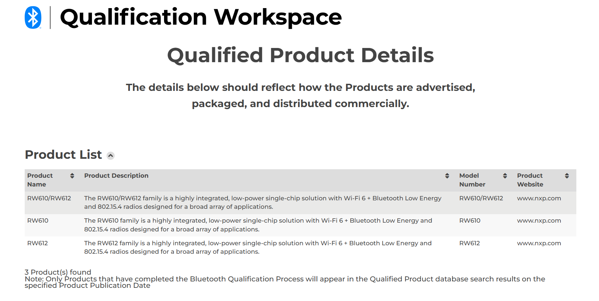
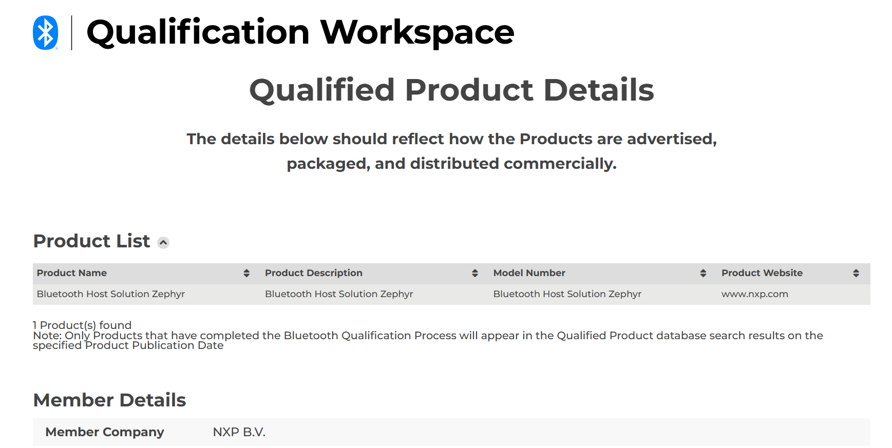

[Index page](../wireless-release-notes.md)

# RW610/RW612 release notes

## Package information
SDK version: v4.1.0

## Version information

Wi-Fi and Bluetooth/Bluetooth LE firmware version firmware version: 18.99.6.p7.1

-   18 - Major revision
-   99 - Feature pack
-   6 - Release version
-   p7.1 - Patch number

## Host platform

RW610/RW612 platform running Zephyr RTOS

Test tools

-   zperf

## WI-Fi and Bluetooth certification

The Wi-Fi and Bluetooth certification is obtained with the following combinations.
### WFA certifications

-   STA \| 802.11n
-   STA \| PMF
-   STA \| FFD
-   STA \| SVD
-   STA \| WPA3 SAE \(R3\)
-   STA \| 802.11ac
-   STA \| 802.11ax
-   STA \| MBO \(agile multiband\)
-   STA \| WPA2 personal and enterprise
-   STA \| WPA3 personal and enterprise
-   STA \| QTT

**Note:** This release supports STAUT only certifications.
### Bluetooth LE controller certification

DN\#: Q338616

Link: [https://qualification.bluetooth.com/ListingDetails/265687](https://qualification.bluetooth.com/ListingDetails/265687)



### OpenThread

Bluetooth LE Host Zephyr Certification

DN\#: Q305748

Link: [https://qualification.bluetooth.com/ListingDetails/227830](https://qualification.bluetooth.com/ListingDetails/227830)



### Matter

Certificate: IDCSA24599MAT44108-50

Link on connectivity standard alliance \(CSA\): [10](references.md#item_csa-rw61x-matter-zephyr)

## Wi-Fi throughput
### Throughput test setup

-   Environment: Shield room - Over the Air
-   Access Point: Asus AX88u
-   DUT: RW610/RW612
-   External Client: PCIE 9098
-   Channel: 6 \| 36
-   Wi-Fi application: wifi\_cli
-   Compiler used to build application: armgcc
-   Compiler version gcc-arm-none-eabi-13.2
-   zperf commands used:

    TCP TX

    ```
    zperf tcp upload  5001 10 1470 114M
    ```

    TCP RX

    ```
    zperf tcp download 5001
    ```

    UDP TX

    ```
    zperf udp upload -a  5001 10 1470 114M ml
    ```
    UDP RX

    ```
    zperf udp download 5001
    ```

**Note:** The default rate is 100 Mbps.
### STA throughput

External AP: Asus AX88u

STA mode throughput - BGN Mode - 2.4 GHz Band - 20 MHz

|Protocol|TCP \(Mbit/s\)|  | UDP \(Mbit/s\)|  |
|--------|--------------|--|---------------|--|
|Direction|TX|RX|TX|RX|
|Open Security|34|32|55|57|
|WPA2-AES|34|33|55|55|
|WPA3-SAE|34|32|56|56|

STA mode throughput - AN Mode - 5 GHz Band - 20 MHz

|Protocol|TCP \(Mbit/s\)|  | UDP \(Mbit/s\)|  |
|--------|--------------|--|---------------|--|
|Direction|TX|RX|TX|RX|
|Open Security|40|37|64|65|
|WPA2-AES|38|37|62|64|
|WPA3-SAE|38|37|62|64|

STA mode throughput - VHT Mode - 2.4 GHz Band - 20 MHz (HT)

|Protocol|TCP \(Mbit/s\)|  | UDP \(Mbit/s\)|  |
|--------|--------------|--|---------------|--|
|Direction|TX|RX|TX|RX|
|Open Security|36|33|63|66|
|WPA2-AES|36|32|65|65|
|WPA3-SAE|35|32|65|65|

STA mode throughput - VHT Mode - 5 GHz Band - 20 MHz

|Protocol|TCP \(Mbit/s\)|  | UDP \(Mbit/s\)|  |
|--------|--------------|--|---------------|--|
|Direction|TX|RX|TX|RX|
|Open Security|40|37|67|70|
|WPA2-AES|40|37|67|70|
|WPA3-SAE|40|37|67|70|

STA mode throughput - HE Mode - 2.4 GHz Band - 20 MHz

|Protocol|TCP \(Mbit/s\)|  | UDP \(Mbit/s\)|  |
|--------|--------------|--|---------------|--|
|Direction|TX|RX|TX|RX|
|Open Security|38|32|86|85|
|WPA2-AES|37|32|87|81|
|WPA3-SAE|37|31|85|82|

STA mode throughput - HE Mode - 5 GHz Band - 20 MHz

|Protocol|TCP \(Mbit/s\)|  | UDP \(Mbit/s\)|  |
|--------|--------------|--|---------------|--|
|Direction|TX|RX|TX|RX|
|Open Security|41|36|94|90|
|WPA2-AES|40|35|94|91|
|WPA3-SAE|40|36|94|91|

### Mobile AP throughput

External client: PCIE 9098

Mobile AP Mode Throughput - BGN Mode - 2.4 GHz Band - 20 MHz

|Protocol|TCP \(Mbit/s\)|  | UDP \(Mbit/s\)|  |
|--------|--------------|--|---------------|--|
|Direction|TX|RX|TX|RX|
|Open Security|36|30|51|48|
|WPA2-AES|34|29|49|45|
|WPA3-SAE|36|29|51|46|

Mobile AP Mode Throughput - AN Mode - 5 GHz Band - 20 MHz

|Protocol|TCP \(Mbit/s\)|  | UDP \(Mbit/s\)|  |
|--------|--------------|--|---------------|--|
|Direction|TX|RX|TX|RX|
|Open Security|43|39|57|63|
|WPA2-AES|44|41|57|62|
|WPA3-SAE|42|39|58|63|

Mobile AP Mode Throughput - VHT Mode - 2.4 GHz Band - 20 MHz

|Protocol|TCP \(Mbit/s\)|  | UDP \(Mbit/s\)|  |
|--------|--------------|--|---------------|--|
|Direction|TX|RX|TX|RX|
|Open Security|36|29|52|47|
|WPA2-AES|35|29|50|45|
|WPA3-SAE|36|29|50|46|

Mobile AP Mode Throughput - VHT Mode - 5 GHz Band - 20 MHz

|Protocol|TCP \(Mbit/s\)|  | UDP \(Mbit/s\)|  |
|--------|--------------|--|---------------|--|
|Direction|TX|RX|TX|RX|
|Open Security|44|41|57|73|
|WPA2-AES|45|40|57|73|
|WPA3-SAE|45|40|57|73|

Mobile AP Mode Throughput - HE Mode - 2.4 GHz Band - 20 MHz

|Protocol|TCP \(Mbit/s\)|  | UDP \(Mbit/s\)|  |
|--------|--------------|--|---------------|--|
|Direction|TX|RX|TX|RX|
|Open Security|41|31|79|71|
|WPA2-AES|40|30|80|70|
|WPA3-SAE|41|30|82|72|

Mobile AP Mode Throughput - HE Mode - 5 GHz Band - 20 MHz

|Protocol|TCP \(Mbit/s\)|  | UDP \(Mbit/s\)|  |
|--------|--------------|--|---------------|--|
|Direction|TX|RX|TX|RX|
|Open Security|47|37|75|89|
|WPA2-AES|47|36|82|85|
|WPA3-SAE|47|37|84|85|

## Known issues

|Component|Description|
|---------|-----------|
|—|—|


