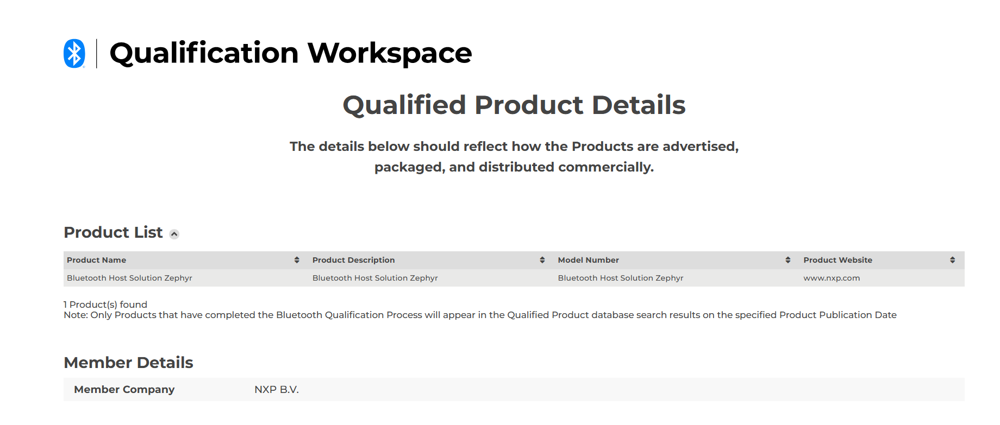

[Index page](../wireless-release-notes.md)

# RW610/RW612 release notes

## Package information
SDK version: v4.4.0

## Version information

Wi-Fi and Bluetooth/Bluetooth LE firmware version firmware version: 18.99.8.p27

-   18 - Major revision
-   99 - Feature pack
-   8 - Release version
-   p27 - Patch number

## Host platform

RW610/RW612 platform running Zephyr RTOS

Test tools

-   zperf

## WI-Fi and Bluetooth certification

The Wi-Fi and Bluetooth certification is obtained with the following combinations.
### WFA certifications

-   STA \| 802.11n
-   STA \| PMF
-   STA \| FFD
-   STA \| SVD
-   STA \| WPA3 SAE \(R3\)
-   STA \| 802.11ac
-   STA \| 802.11ax
-   STA \| MBO \(agile multiband\)
-   STA \| WPA2 personal and enterprise
-   STA \| WPA3 personal and enterprise
-   STA \| QTT

**Note:** This release supports STAUT only certifications.
### Bluetooth LE controller certification

DN\#: Q380314

Link: [https://qualification.bluetooth.com/ListingDetails/323344](https://qualification.bluetooth.com/ListingDetails/323344)


### Bluetooth LE Host Zephyr Certification

DN\#: Q305748

Link: [https://qualification.bluetooth.com/ListingDetails/227830](https://qualification.bluetooth.com/ListingDetails/227830)



### Matter

Certificate: CSA25AD6MAT47656-24

Link to connectivity standard alliance \(CSA\): [9](references.md)

## Wi-Fi throughput
### Throughput test setup

-   Environment: Shield room - Over the Air
-   Access Point: Asus AX88u
-   DUT: RW610/RW612
-   External Client: PCIE 9098
-   Channel: 6 \| 36
-   Wi-Fi application: wifi\_cli
-   Compiler used to build application: armgcc
-   Compiler version gcc-arm-none-eabi-13.2
-   zperf commands used:

    TCP TX

    ```
    zperf tcp upload  5001 10 1470 114M
    ```

    TCP RX

    ```
    zperf tcp download 5001
    ```

    UDP TX

    ```
    zperf udp upload -a  5001 10 1470 114M ml
    ```
    UDP RX

    ```
    zperf udp download 5001
    ```

**Note:** The default rate is 100 Mbps.
### STA throughput

External AP: Asus AX88u

STA mode throughput - BGN Mode - 2.4 GHz Band - 20 MHz

| Protocol      | TCP (Mbit/s) | TCP (Mbit/s) | UDP (Mbit/s) | UDP (Mbit/s) |
|:--------------|:-------------:|:-------------:|:-------------:|:-------------:|
|Direction|TX|RX|TX|RX|
|Open Security|33|42|68|66|
|WPA2-AES|33|42|64|65|
|WPA3-SAE|32|44|66|65|

STA mode throughput - AN Mode - 5 GHz Band - 20 MHz

| Protocol      | TCP (Mbit/s) | TCP (Mbit/s) | UDP (Mbit/s) | UDP (Mbit/s) |
|:--------------|:-------------:|:-------------:|:-------------:|:-------------:|
|Direction|TX|RX|TX|RX|
|Open Security|34|48|76|76|
|WPA2-AES|35|48|74|75|
|WPA3-SAE|35|48|74|75|

STA mode throughput - VHT Mode - 2.4 GHz Band - 20 MHz

| Protocol      | TCP (Mbit/s) | TCP (Mbit/s) | UDP (Mbit/s) | UDP (Mbit/s) |
|:--------------|:-------------:|:-------------:|:-------------:|:-------------:|
|Direction|TX|RX|TX|RX|
|Open Security|32|43|71|70|
|WPA2-AES|35|41|64|69|
|WPA3-SAE|36|42|64|69|

STA mode throughput - VHT Mode - 5 GHz Band - 20 MHz

| Protocol      | TCP (Mbit/s) | TCP (Mbit/s) | UDP (Mbit/s) | UDP (Mbit/s) |
|:--------------|:-------------:|:-------------:|:-------------:|:-------------:|
|Direction|TX|RX|TX|RX|
|Open Security|36|48|76|76|
|WPA2-AES|34|48|74|75|
|WPA3-SAE|33|42|74|71|

STA mode throughput - HE Mode - 2.4 GHz Band - 20 MHz

| Protocol      | TCP (Mbit/s) | TCP (Mbit/s) | UDP (Mbit/s) | UDP (Mbit/s) |
|:--------------|:-------------:|:-------------:|:-------------:|:-------------:|
|Direction|TX|RX|TX|RX|
|Open Security|36|46|90|92|
|WPA2-AES|34|44|89|85|
|WPA3-SAE|34|44|89|85|

STA mode throughput - HE Mode - 5 GHz Band - 20 MHz

| Protocol      | TCP (Mbit/s) | TCP (Mbit/s) | UDP (Mbit/s) | UDP (Mbit/s) |
|:--------------|:-------------:|:-------------:|:-------------:|:-------------:|
|Direction|TX|RX|TX|RX|
|Open Security|38|51|98|102|
|WPA2-AES|39|50|97|100|
|WPA3-SAE|38|50|97|100|

### Mobile AP throughput

External client: PCIE 9098

Mobile AP Mode Throughput - BGN Mode - 2.4 GHz Band - 20 MHz

| Protocol      | TCP (Mbit/s) | TCP (Mbit/s) | UDP (Mbit/s) | UDP (Mbit/s) |
|:--------------|:-------------:|:-------------:|:-------------:|:-------------:|
|Direction|TX|RX|TX|RX|
|Open Security|35|40|59|60|
|WPA2-AES|35|40|59|60|
|WPA3-SAE|34|40|58|59|

Mobile AP Mode Throughput - AN Mode - 5 GHz Band - 20 MHz

| Protocol      | TCP (Mbit/s) | TCP (Mbit/s) | UDP (Mbit/s) | UDP (Mbit/s) |
|:--------------|:-------------:|:-------------:|:-------------:|:-------------:|
|Direction|TX|RX|TX|RX|
|Open Security|37|44|63|64|
|WPA2-AES|37|43|61|64|
|WPA3-SAE|39|43|61|64|

Mobile AP Mode Throughput - VHT Mode - 2.4 GHz Band - 20 MHz

| Protocol      | TCP (Mbit/s) | TCP (Mbit/s) | UDP (Mbit/s) | UDP (Mbit/s) |
|:--------------|:-------------:|:-------------:|:-------------:|:-------------:|
|Direction|TX|RX|TX|RX|
|Open Security|32|43|55|70|
|WPA2-AES|36|42|63|69|
|WPA3-SAE|35|42|63|69|

Mobile AP Mode Throughput - VHT Mode - 5 GHz Band - 20 MHz

| Protocol      | TCP (Mbit/s) | TCP (Mbit/s) | UDP (Mbit/s) | UDP (Mbit/s) |
|:--------------|:-------------:|:-------------:|:-------------:|:-------------:|
|Direction|TX|RX|TX|RX|
|Open Security|42|46|76|76|
|WPA2-AES|42|46|74|75|
|WPA3-SAE|42|46|74|74|

Mobile AP Mode Throughput - HE Mode - 2.4 GHz Band - 20 MHz

| Protocol      | TCP (Mbit/s) | TCP (Mbit/s) | UDP (Mbit/s) | UDP (Mbit/s) |
|:--------------|:-------------:|:-------------:|:-------------:|:-------------:|
|Direction|TX|RX|TX|RX|
|Open Security|40|44|91|91|
|WPA2-AES|40|44|90|80|
|WPA3-SAE|40|44|91|80|

Mobile AP Mode Throughput - HE Mode - 5 GHz Band - 20 MHz

| Protocol      | TCP (Mbit/s) | TCP (Mbit/s) | UDP (Mbit/s) | UDP (Mbit/s) |
|:--------------|:-------------:|:-------------:|:-------------:|:-------------:|
|Direction|TX|RX|TX|RX|
|Open Security|47|52|91|90|
|WPA2-AES|46|52|91|90|
|WPA3-SAE|46|52|91|90|

## Bug fixes and/or feature enhancements

### Firmware version: From 18.99.6.p7.1 to 18.99.6.p42

|Component|Description|
|---------|-----------|
|-|-|

### Firmware version: From 18.99.6.p6.42 to 18.99.6.p49

|Component|Description|
|---------|-----------|
|-|-|

### Firmware version: From 18.99.6.p49 to 18.99.8.p27

|Component|Description|
|---------|-----------|
|Wi-Fi|<ul><li>System assert while trying to reboot RW612</ul></li><ul><li>The DUT failed to authenticate with the AP in STA/AP mode during DPP responder authentication, resulting in a DPP Configuration Failed error.</ul></li>|
|Coexistance|<ul><li>Resolved a random assertion failure issue where the DUT entered an unstable state, with "ASSERTION FAIL" messages printed on the console during operation.</ul></li><ul><li>Fixed a compilation failure observed while building the Tri‑Radio application.</ul></li><ul><li>Enabled MbedTLS 4.x</ul></li>|

## Known issues

|Component|Description|
|---------|-----------|
|-|-|


