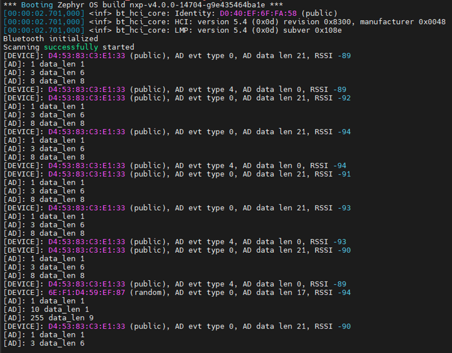
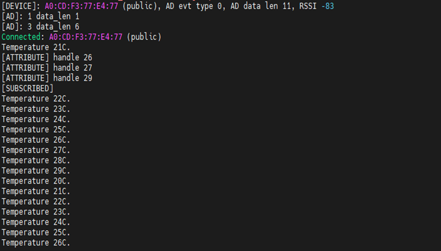
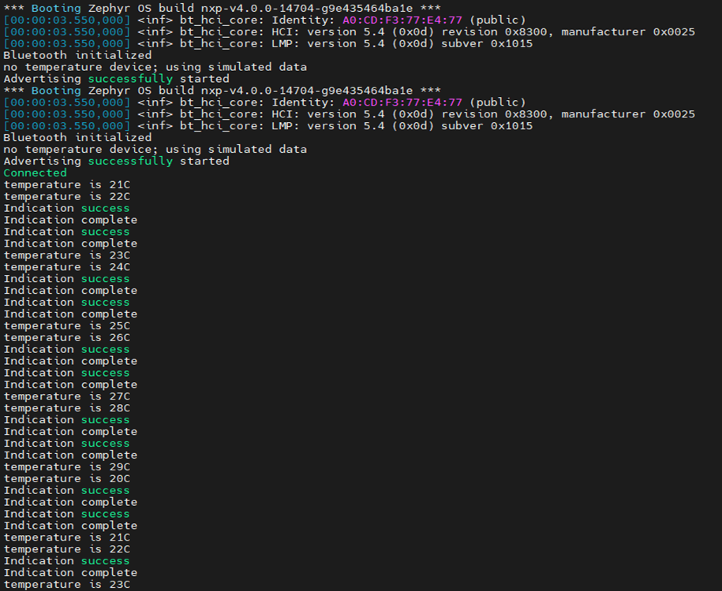
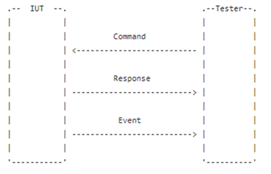
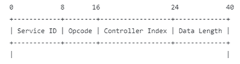
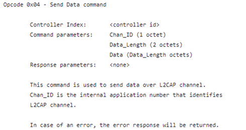
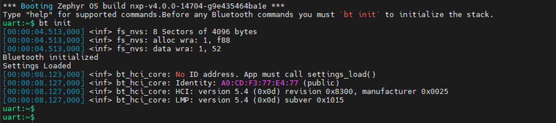
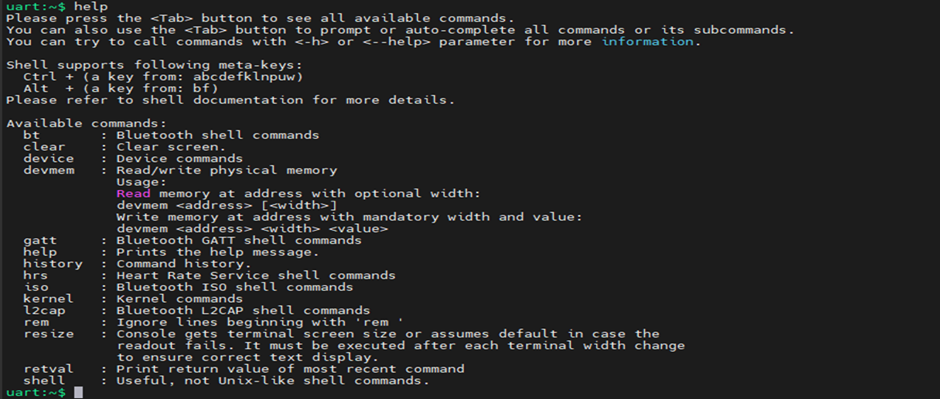
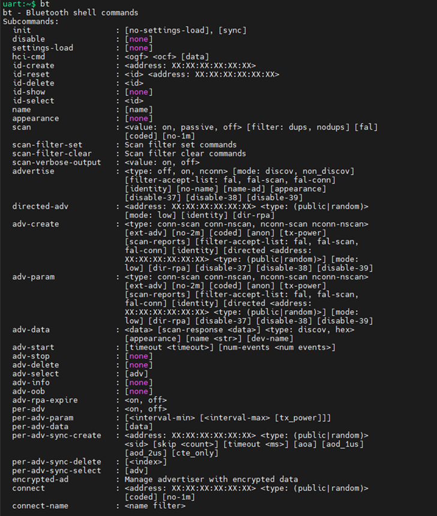
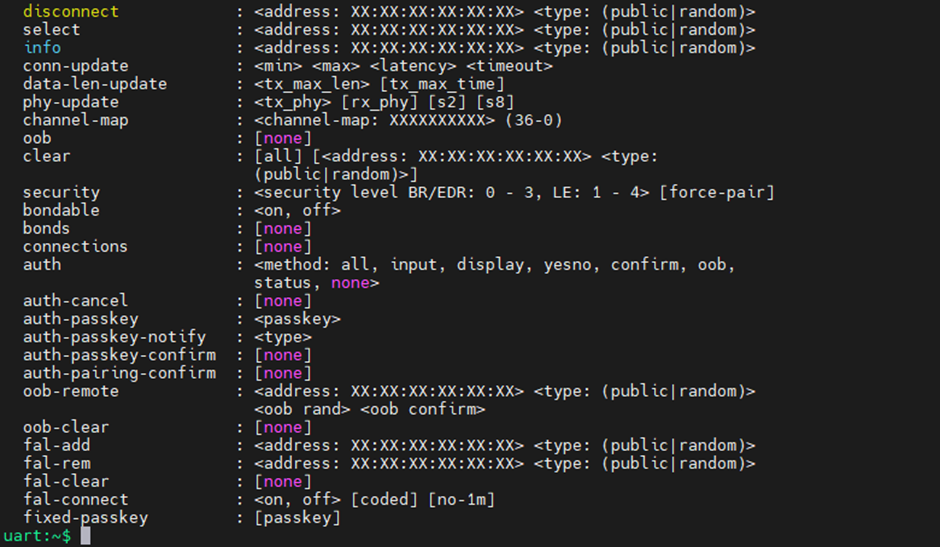

[Index page](../Wi-Fi_Bluetooth_and_Thread_User_Manual_for_Zephyr.md)

# Bluetooth examples and commands

This documentation describes various Bluetooth examples running on Zephyr OS.

 - central_ht
 - peripheral_ht
 - bt_tester
 - bt shell

## central_ht example

Central_ht is a Health Thermometer sensor profile based on an app, similar to the Peripheral sample, except that this application specifically looks for a health thermometer sensor and reports the die temperature readings once connected. When the app starts, it will scan an advertising device with RSSI value reported. Then central_ht will connect the advertiser with the highest RSSI value.

- Build central_ht example
```bash
west build -p always -b mimxrt1060_evk@C --shield [Shield name] samples/bluetooth/central_ht/ -d central_ht
```
|Wireless chip|Shield name|
|:--------:|:--------:|
|IW416|nxp_m2_1xk_wifi_bt|
|IW612|nxp_m2_2el_wifi_bt|
|IW610|nxp_m2_2ll_wifi_bt|

> **Note:** Use [Shield name] as per above table.

After connection is done, central_ht will receive health thermometer senor value initiated by peripheral




## peripheral_ht example

Similar to the Central sample, except that this application specifically exposes the HT (Health Thermometer) GATT Service.

When the app starts, it will start advertising, waiting for the remote device to connect. After connection is done, peripheral_ht starts indicating temperature value to central device.


- Build peripheral_ht example
```bash
west build -p always -b mimxrt1060_evk@C --shield [Shield name] samples/bluetooth/peripheral_ht/ -d peripheral_ht
```
|Wireless chip|Shield name|
|:--------:|:--------:|
|IW416|nxp_m2_1xk_wifi_bt|
|IW612|nxp_m2_2el_wifi_bt|
|IW610|nxp_m2_2ll_wifi_bt|
> **Note:** Use [Shield name] as per above table.



## bt_tester example

bt_test follows Bluetooth test protocol(btp), defined command/Response/Event. Please refer https://github.com/auto-pts/auto-pts/tree/master/doc

- Build bt_tester example
```bash
west build -p always -b mimxrt1060_evk@C --shield [Shield name] tests/bluetooth/tester/ -d bt_tester
```
> **Note:** Use [Shield name] as per above table.

There will not be any console available for bt_tester. You will need to build auto-pts setup between DUT(IW416/IW612/IW610) and remote devices like bluetooth dongles. Please refer to the link for more details- https://docs.zephyrproject.org/latest/connectivity/bluetooth/autopts/autopts-linux.html



Command/response/Event following format as below:



If user want to use bt_tester manually trigger LE data traffic, after LE connection is done, L2CAP service, command with opcode 0x4 can be used to send data.


## bt shell example

The Bluetooth Shell is an application based on the Shell module. It offers a collection of commands made to easily interact with the Bluetooth stack.

- Build bt shell example
```bash
west build -p always -b mimxrt1060_evk@C --shield [Shield name] tests/bluetooth/shell -d bluetooth_shell
```
> **Note:** Use [Shield name] as per above table.

- Enable Bluetooth with bt init command

The following message is printed to confirm Bluetooth has been initialized.

List all supporting top commands with help command

List all BT commands with bt command


Example of bt hci-cmd to read the FW version of wireless chip


