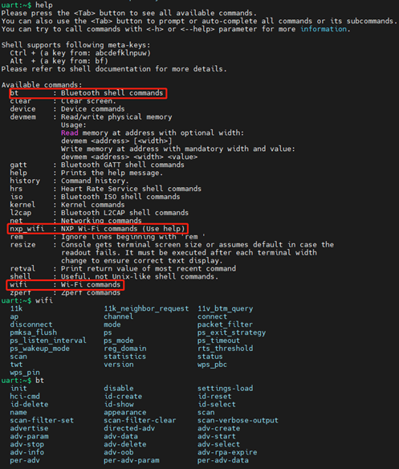
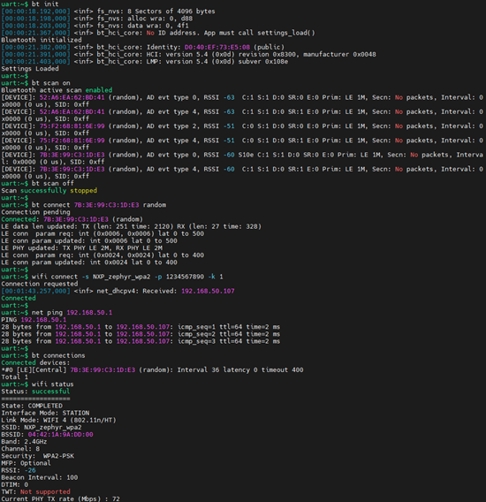

[Index page](../Wi-Fi_Bluetooth_and_Thread_User_Manual_for_Zephyr.md)

# Coexistence example and commands

This section describes the building and usages of coexistence example for the target modules on the Zephyr OS. The coexistence example combines Bluetooth and Wi-Fi commands into one single example and supports concurrent Wi-Fi and Bluetooth operations.

## Build coexistence example

Below is the list of Wi-Fi + BT coexistence examples supported by each wireless chip:

|Wireless chip|Coex example|BT example path|
|:------------|:-----------|:--------------|
|IW416/IW612| Wi-Fi shell + BT shell  | samples/wireless/coex/shell|
|IW610| Wi-Fi shell + BT shell        | samples/wireless/coex/shell|
|IW610| Wi-Fi shell + BT tester       | samples/wireless/coex/tester|
|IW610| Wi-Fi shell + BT peripheral ht| samples/wireless/coex/peripheral_ht|
|IW610| Wi-Fi shell + BT central ht   | samples/wireless/coex/central_ht|
> **Note:** The BT example path is to specify Bluetooth example folder path, which are used as parameters in the coexistence example build commands.

Below shows how to use west command to build target coexistence examples:

- Build a coex example with embedded Wi-Fi supplicant:
```bash
west build -p always -b mimxrt1060_evk@C --shield [shield_name] [BT example path] -d coex -DEXTRA_CONF_FILE="[conf files]"
```

|Wireless chip|Conf files|Shield name|
|:------------|:---------|:----------|
|IW416|overlay_hosted_mcu.conf|nxp_m2_1xk_wifi_bt|
|IW612|overlay_hosted_mcu.conf|nxp_m2_2el_wifi_bt|
|IW610|overlay_iw610.conf|nxp_m2_2ll_wifi_bt|

> **Note:** The wpa/wpa2/wpa3 supplicant is implemented in IW416/IW612/IW610 firmware, which is released in binary.

- Build a coex example with host-based supplicant:

```bash
west build -p always -b mimxrt1060_evk@C --shield [shield_name] [BT example path] -d coex -DEXTRA_CONF_FILE="[conf files]"
```
|Wireless chip|Conf files|Shield name|
|:------------|:---------|:----------|
|IW416|overlay_hosted_mcu.conf; overlay_hostap_hosted_mcu.conf|nxp_m2_1xk_wifi_bt|
|IW612|overlay_hosted_mcu.conf; overlay_hostap_hosted_mcu.conf|nxp_m2_2el_wifi_bt|
|IW610|overlay_iw610.conf; overlay_hostap_hosted_mcu.conf|nxp_m2_2ll_wifi_bt|

> **Note:** The wpa/wpa2/wpa3 supplicant runs on i.MXRT1060 MCU and is released in source code.

For example, to build Wi-Fi shell + BT tester coex example with host-based supplicant for IW610 module:

```bash
west build -p always -b mimxrt1060_evk@C --shield nxp_m2_2ll_wifi_bt samples/wireless/coex/tester -d coex_tester -DEXTRA_CONF_FILE="overlay-wifi-nxp-iw610.conf;overlay-wifi-nxp-hostap-hosted-mcu.conf"
```

## Run coexistence example

Flash the coexistence example binary and reboot system. Use **help** to show all supported commands for all Wi-Fi commands encapsulated under **wifi** menu and **nxp_wifi** menu, and for all Bluetooth shell command encapsulated under “bt” menu.



To establish the Bluetooth Low Energy and Wi-Fi connection, follow the example steps below:

- Initialize the Bluetooth Low Energy
```bash
#bt init
```
- Scan the Bluetooth Low Energy devices
```bash
#bt scan on  //To start scanning
#bt scan off  //To stop scanning
```
- Bluetooth Low Energy connection with remote device
```bash
#bt connect <remote BT address> <address type>
```
- Wi-Fi connection with external AP (configure channel in 2.4 GHz) in WPA2 personal mode
```bash
#wifi connect -s <ssid> -p <password> -k 1
```

- Check the data traffic on the Wi-Fi interface using ping
```bash
#net ping <IP address>
```

- Check the status of the Wi-Fi connection
```bash
#wifi status
```

- Check the status of Bluetooth Low Energy connection
```bash
#bt info
```
Or
```bash
#bt connections
```

Sample output:



## Coexistence command syntax

This chapter describes NXP proprietary coexistence commands supported in Zephyr example.

NXP proprietary coexistence commands
|Command Name|Description|
|:-----------|:----------|
|nxp_wifi single-ant-duty-cycle|Configure Wi-Fi/15.4 duty cycle coexistence mechanism for single antenna design|
|nxp_wifi dual-ant-duty-cycle|Configure Wi-Fi/15.4 duty cycle coexistence mechanism for dual antenna design|
|nxp_wifi external-coex-pta|Configure coexistence mechanism for NXP module coexistence with external module|
|nxp_wifi ext-coex-uwb|Enable coexistence mechanism for NXP module coexistence with external UWB module|
> **Note:** For external-coex-pta and ext-coex-uwb external, coexistence commands are implemented but have not been validated.

- Set single-ant-duty-cycle command syntax
```bash
nxp_wifi single-ant-duty-cycle <enable/disable> [<Ieee154Duration> <TotalDuration>]
```

|Parameter|Description|
|:--------|:----------|
|Enable/Disable|Enable/disable Wi-Fi/15.4 duty cycle coex mode <br> Enable = 1/Disable = 0 |
|Ieee154Duration|Set 15.4 duration time <br> Enter the value in Units(1 Unit = 1 ms)|
|TotalDuration|Set total duty cycle duration time <br> Enter the value in Units(1 Unit = 1 ms)|

> **Note:** Ieee154Duration must not be equal to TotalDuration-Ieee154Duration and not more than TotalDuration.

Example of command:

Enable single-ant-duty-cycle.

```bash
nxp_wifi single-ant-duty-cycle 1 32 62
```
Example of output:
```bash
Set single ant duty cycle successfully
Command wlan-single-ant-duty-cycle
```
Disable single-ant-duty-cycle.
```bash
nxp_wifi single-ant-duty-cycle 0
```

- Set dual-ant-duty-cycle command syntax
```bash
nxp_wifi dual-ant-duty-cycle <enable/disable> / [<Ieee154Duration> <TotalDuration> <Ieee154FarRangeDuration>]
```
|Parameter|Description|
|:--------|:----------|
|Enable/Disable|Enable/disable Wi-Fi/15.4 duty cycle coex mode <br> Enable = 1/Disable = 0 |
|Ieee154Duration|Set 15.4 duration time <br> Enter the value in Units(1Unit=1ms)|
|TotalDuration|Set total duty cycle duration time <br> Enter the value in Units(1 Unit = 1 ms)|
|Ieee154FarRangeDuration|Set 15.4 far range duration <br> Enter the value in Units (1 Unit = 1 ms)|
> **Note:** Ieee154Duration and Ieee154FarRangeDuration must not be equal to TotalDuration-Ieee154Duration, Ieee154Duration must not be more than TotalDuration.

Example of command:

Enable dual-ant-duty-cycle or dual-ant-duty-cycle
```bash
nxp_wifi dual-ant-duty-cycle 1 5 35 32
```

Example of output:
```bash
Set dual ant duty cycle successfully
Command wlan-dual-ant-duty-cycle
```

Disable dual-ant-duty-cycle.
```bash
nxp_wifi dual-ant-duty-cycle 0
```

- Set external-coex-pta command syntax:
```bash
nxp_wifi external-coex-pta enable <PTA/WCI-2/WCI-2 GPIO> ExtWifiBtArb <enable/disable> PolGrantPin <high/low> PriPtaInt <enable/disable>  StateFromPta <state pin/ priority pin/ state input disable> SampTiming <Sample timing> InfoSampTiming <Sample timing> TrafficPrio <enable/disable> CoexHwIntWic <enable/disable>
```

|Parameter |Description|
|:---------|:---------|
|Enable / Disable <PTA/WCI-2/WCI-2 GPIO>| Enable/disable external coex mode <br> Select PTA interface: 5 <br> Select WCI-2 interface: 6 <br> Select WCI-2 GPIO interface: 7|
|ExtWifiBtArb|Enable/disable Wi-Fi/BT/MWS arbitration <br> Enable Ext-WifiBtArb: 1 <br>Disable Ext-WifiBtArb: 0 |
|PolGrantPin|Set polarity of Grant GPIO pin <br> Active High: 0 <br> Active Low: 1 |
|PriPtaInt|Enable/disable Priority GPIO pin <br> Enable PriPta-Init: 1 <br> Disable PriPta-Init: 0|
|StateFromPta|Enable/disable state info sampling <br> Disable state info sample : 0 <br> Sample state info on state pin : 1 <br> Sample state info on priority pin: 2|
|SampTiming|Set sample timing of Priority bit <br> Sample timing range [20, 200] <br> Default value: 100 <br> Enter the value in Units (1 Unit = 1 ms)|
|InfoSampTiming|Set sample timing of Tx/Rx info <br> Sample timing range [20, 200] <br> Default value: 100 <br> Enter the value in Units (1 Unit = 1 ms)|
|TrafficPrio|Enable external traffic Tx/Rx Priority: 1 <br> Disable external traffic Tx/Rx Priority: 0|
|CoexHwIntWic|Enable the WCI-2 interface: 1 <br> Disable WCI-2 interface: 0|

Example of command:
```bash
nxp_wifi external-coex-pta enable 5 ExtWifiBtArb 1 PolGrantPin 0 PriPtaInt 1 StateFromPta 2 SampTiming 150 InfoSampTiming 60 TrafficPrio 1 CoexHwIntWic 1
```

Example of output:
```bash
Success to set external coex pta config:
Enable PTA interface.
Enable WifiBtArb.
PolGrantPin active High.
Enable PriPtaInt.
State info is sampled on priority pin.
Timing to sample Priority bit: 150.
Timing to sample Tx/Rx info: 60.
Enable external traffic Tx/Rx Priority.
Enable WCI-2 interface.
```

- Set ext-coex-uwb command syntax
```bash
nxp_wifi ext-coex-uwb
```

Example of command:

Enable external UWB coex.

```bash
nxp_wifi ext-coex-uwb
```

Example of output:

```bash
Hostcmd success, response is
e0  80  11  0  1e  0  1  0  1  0  0  0  38  2 1  0  3  Command wlan-ext-coex-uwb
```
