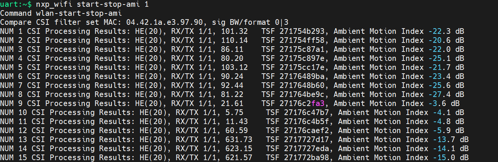

[Index page](../Wi-Fi_Bluetooth_and_Thread_User_Manual_for_Zephyr.md)

# Wi-Fi examples and commands

This chapter describes Wi-Fi shell example and its commands usage in separate sections. Wi-Fi shell is an default example included in Zephyr SDK regular release. It integrates Zephyr common Wi-Fi commands and NXP proprietary command which starts with prefix **nxp_wifi**.

## Build Wi-Fi shell example

Wi-Fi shell example provides options to build with embedded supplicant and host based supplicant. The following are instructions to build them separately.

- Build Wi-Fi shell example with embedded supplicant

```bash
west build -b mimxrt1060_evk@C samples/net/wifi/shell -d [build_folder] --pristine -DEXTRA_CONF_FILE="[conf files]" --shield [shield name]
```

| Wireless chip |         Conf files         |    Shield name    |
| :-----------: | :-------------------------: | :----------------: |
|     IW416     | nxp/overlay_hosted_mcu.conf | nxp_m2_1xk_wifi_bt |
|     IW612     | nxp/overlay_hosted_mcu.conf | nxp_m2_2el_wifi_bt |
|     IW610     |   nxp/overlay_iw610.conf   | nxp_m2_2ll_wifi_bt |

> **Note:** wpa/wpa2/wpa3 supplicant is implemented in IW416/IW612/IW610 firmware which is released in binary.

- Build Wi-Fi shell example with host based supplicant

```bash
west build -b mimxrt1060_evk@C samples/net/wifi/shell -d [build_folder] --pristine -DEXTRA_CONF_FILE="[conf files]" --shield [shield name]
```

| Wireless chip |                             Conf files                             |    Shield name    |
| :-----------: | :-----------------------------------------------------------------: | :----------------: |
|     IW416     | nxp/overlay_hosted_mcu.conf<br />nxp/overlay_hostap_hosted_mcu/conf | nxp_m2_1xk_wifi_bt |
|     IW612     |   nxp/overlay_iw610.conf<br />nxp/overlay_hostap_hosted_mcu.conf   | nxp_m2_2el_wifi_bt |
|     IW610     |   nxp/overlay_iw610.conf<br />nxp/overlay_hostap_hosted_mcu.conf   | nxp_m2_2ll_wifi_bt |

> **Note:** wpa/wpa2/wpa3 supplicant run on i.MXRT1060 MCU and is released in source code.

## Set/Get MAC Address

The following commands are used to set and get Wi-Fi MAC address.

- Set MAC address

```bash
uart:~$ nxp_wifi set-mac 00:50:43:02:33:99
```

- Get MAC address:

```bash
uart:~$ nxp_wifi mac
MAC address
STA MAC Address: 00:50:43:02:33:99
uAP MAC Address: 00:50:43:02:34:99
```

## Scan Command

The following commands are used to scan access points with different configuration

- Wild scan

```bash
uart:~$ nxp_wifi scan
Scan scheduled...
2 networks found:
C8:9E:43:5A:6D:A9  "lhx_ap_roam" Infra
	mode: 802.11AX
	channel: 6
	rssi: -30 dBm
	security: WPA3 SAE
	WMM: YES
	802.11K: YES
	802.11V: YES
	802.11W: Capable, Required
	WPS: YES, Session: Not active
04:A1:51:AB:07:1F  "xue-2g" Infra
	mode: 802.11N
	channel: 7
	rssi: -38 dBm
	security: WPA2
	WMM: YES
	802.11W: NA
	WPS: YES, Session: Not active
```

- Scan with specific SSID

```bash
uart:~$ nxp_wifi scan-opt ssid NXPOPEN
Scan for ssid "NXPOPEN" scheduled...
3 networks found:
1C:6A:7A:87:FF:B1  "NXPOPEN" Infra
	mode: 802.11N
	channel: 1
	rssi: -36 dBm
	security: WPA2
	WMM: YES
	802.11K: YES
	802.11V: YES
	802.11W: NA
	WPS: NO
F8:C2:88:74:92:52  "NXPOPEN" Infra
	mode: 802.11N
	channel: 1
	rssi: -67 dBm
	security: WPA2
	WMM: YES
	802.11K: YES
	802.11V: YES
	802.11W: NA
	WPS: NO
24:16:9D:3E:61:61  "NXPOPEN" Infra
	mode: 802.11N
	channel: 11
	rssi: -61 dBm
	security: WPA2
	WMM: YES
	802.11K: YES
	802.11V: YES
	802.11W: NA
	WPS: NO
```

- Scan with specific SSID and channel

```bash
uart:~$ nxp_wifi scan-opt ssid NXPOPEN channel 1
Scan for ssid "NXPOPEN" scheduled...
2 networks found:
1C:6A:7A:87:FF:B1  "NXPOPEN" Infra
	mode: 802.11N
	channel: 1
	rssi: -46 dBm
	security: WPA2
	WMM: YES
	802.11K: YES
	802.11V: YES
	802.11W: NA
	WPS: NO
F8:C2:88:74:92:52  "NXPOPEN" Infra
	mode: 802.11N
	channel: 1
	rssi: -66 dBm
	security: WPA2
	WMM: YES
	802.11K: YES
	802.11V: YES
	802.11W: NA
	WPS: NO
```

- Scan with specific SSID and RSSI threshold

```bash
uart:~$ nxp_wifi scan-opt ssid NXPOPEN rssi_threshold -50
Scan for ssid "NXPOPEN" scheduled...
2 networks found:
1C:6A:7A:87:FF:B1  "NXPOPEN" Infra
	mode: 802.11N
	channel: 1
	rssi: -38 dBm
	security: WPA2
	WMM: YES
	802.11K: YES
	802.11V: YES
	802.11W: NA
	WPS: NO
1C:6A:7A:87:FF:BE  "NXPOPEN" Infra
	mode: 802.11AC
	channel: 161
	rssi: -32 dBm
	security: WPA2
	WMM: YES
	802.11K: YES
	802.11V: YES
	802.11W: NA
	WPS: NO
```

- Scan with specific BSSID

```bash
uart:~$ nxp_wifi scan-opt bssid 1C:6A:7A:87:FF:B1
Scan for bssid 1C:6A:7A:87:FF:B1 scheduled...
1 network found:
1C:6A:7A:87:FF:B1  "NXPOPEN" Infra
	mode: 802.11N
	channel: 1
	rssi: -42 dBm
	security: WPA2
	WMM: YES
	802.11K: YES
	802.11V: YES
	802.11W: NA
	WPS: NO
```

## Get Wi-Fi Version

The following command is used to get Wi-Fi driver and firmware version.

```bash
uart:~$ wifi version
Wi-Fi Driver Version: v1.3.r51.z_up.p1
Wi-Fi Firmware Version: IW416-V0, RF878X, FP91, 16.92.21.p142.5, WPA2_CVE_FIX 1, PVE_FIX 1
```

## Set/Get Region Domain

The following command is used to get region domain.

```bash
uart:~$ wifi reg_domainWi-Fi Regulatory domain is: WW
Wi-Fi Power Save
```

## Wi-Fi Power Save

The following commands are used to configure different Wi-Fi power mode.

### IEEE power save

IEEE PS mode is only activated after Wi-Fi station connects to AP after enablement.

- IEEEPS Usage:

```bash
uart:~$ nxp_wifi ieee-ps
Usage: ieee-ps <0/1>
Error: Specify 0 to Disable or 1 to Enable
```

- Enable IEEE PS

```bash
uart:~$ nxp_wifi ieee-ps 1
[00:19:13.538,000] <dbg> nxp_wifi: nxp_wifi_wlan_event_callback: WLAN: received event 18
[00:19:13.546,000] <dbg> nxp_wifi: nxp_wifi_wlan_event_callback: WLAN: PS_ENTER
Turned on IEEE Power Save mode
```

- Disable IEEE PS

```bash
uart:~$ nxp_wifi ieee-ps 0
Turned off IEEE Power Save mode
Command wlan-ieee-ps
[00:19:37.629,000] <dbg> nxp_wifi: nxp_wifi_wlan_event_callback: WLAN: received event 19
[00:19:37.638,000] <dbg> nxp_wifi: nxp_wifi_wlan_event_callback: WLAN: PS EXIT
```

### DeepSleep

DeepSleep mode is only activated when Wi-Fi is in disconnected state after enablement.

- DeepSleep Usage:

```bash
uart:~$ nxp_wifi deep-sleep-ps
Usage: deep-sleep-ps <0/1>
Error: Specify 0 to Disable or 1 to Enable
```

- Enable DeepSleep

```bash
uart:~$ nxp_wifi deep-sleep-ps 1
[00:26:37.087,000] <dbg> nxp_wifi: nxp_wifi_wlan_event_callback: WLAN: received event 18
[00:26:37.096,000] <dbg> nxp_wifi: nxp_wifi_wlan_event_callback: WLAN: PS_ENTER
Turned on Deep Sleep Power Save mode
```

- Disable DeepSleep

```bash
uart:~$ nxp_wifi deep-sleep-ps 0
Turned off Deep Sleep Power Save mode
Command wlan-deep-sleep-ps
[00:27:16.314,000] <dbg> nxp_wifi: nxp_wifi_wlan_event_callback: WLAN: received event 19
[00:27:16.325,000] <dbg> nxp_wifi: nxp_wifi_wlan_event_callback: WLAN: PS EXIT
```

### WMM power save

For WMM PS mode, the Wi-Fi station should be connected with AP

- WMM power save usage:

```bash
uart:~$ nxp_wifi uapsd-enable
Usage: uapsd-enable <enable>
0 to Disable UAPSD
1 to Enable UAPSD
```

- Enable UAPSD

```bash
uart:~$ nxp_wifi uapsd-enable 0
Command wlan-uapsd-enable
[00:23:02.642,000] <dbg> nxp_wifi: nxp_wifi_wlan_event_callback: WLAN: received event 19
[00:23:02.653,000] <dbg> nxp_wifi: nxp_wifi_wlan_event_callback: WLAN: PS EXIT
```

- Disable UAPSD

```bash
uart:~$ nxp_wifi uapsd-enable 1
Command wlan-uapsd-enable
[00:23:21.133,000] <dbg> nxp_wifi: nxp_wifi_wlan_event_callback: WLAN: received event 18
[00:23:21.143,000] <dbg> nxp_wifi: nxp_wifi_wlan_event_callback: WLAN: PS_ENTER
```

- Configure WMM power save sleeping period

```bash
Usage: wlan-apsd-sleep-period <period(ms)>
uart:~$ nxp_wifi uapsd-sleep-period 30
```

The uapsd_sleep_period default is 20ms when UAPSD is enable

- Get WMM power save sleeping period

```bash
uart:~$ nxp_wifi uapsd-sleep-period
period = 30
```

### WMM QoS Info

- Enable/disable WMM QoS

```bash
uart:~$ nxp_wifi uapsd-enable
Usage: uapsd-enable <enable>
0 to Disable UAPSD
1 to Enable UAPSD
```

- Set QoS info

```bash
uart:~$ nxp_wifi uapsd-qosinfo 10
```

- Get QoS info

```bash
uart:~$ nxp_wifi uapsd-qosinfo
qos_info = 15
```

### Get power save configuration

```bash
uart:~$ nxp_wifi get-ps-cfg
Power save mode setting:
IEEE ps   : 1
Deep sleep: 1
```

## TX A-MPDU protection mode

This command is used to set either RTS/CTS or CTS2SELF protection mechanism in MAC for aggregated Tx QoS data frames. RTS/CTS is enabled by default.

- Command Usage

```bash
uart:~$ nxp_wifi tx-ampdu-prot-mode
Usage:
wlan-tx-ampdu-prot-mode `<mode>`
	<mode>: 0 - Set RTS/CTS mode
		1 - Set CTS2SELF mode
		2 - Disable Protection mode
		3 - Set Dynamic RTS/CTS mode
```

- Get currently set protection mode for TX AMPDU.

```bash
uart:~$ nxp_wifi tx-ampdu-prot-mode
```

- Set protection mode for TX AMPDU to CTS2SELF.

```bash
nxp_wifi tx-ampdu-prot-mode 1
```

## Get signal info

This command gets the last and average value of RSSI, SNR and NF of Beacon and Data.

> **Note:** This command is available only when STA is connected.

```bash
uart:~$ nxp_wifi get-signal
BeaconLast      Beacon Average  Data Last       Data Average

RSSI            -71             -72             -73             -73

SNR              21              21              20              20

NF              -92             -93             -93             -93
```

## Turbo mode

These commands are used to set/get STA/UAP turbo mode.

- Get STA/UAP curent turbo mode :

```bash
uart:~$ nxp_wifi get-turbo-mode
Usage: wlan-get-turbo-mode STA/UAP
```

- Set STA/UAP turbo mode:

```bash
uart:~$ nxp_wifi set-turbo-mode
Usage: wlan-set-turbo-mode <STA/UAP> <mode>
	<STA/UAP>  'STA'  or 'UAP'
	<mode> can be 0,1,2,3
```

## Set/Get channel list

The following command is used to set/get 2G/5G channel list configuration.

- Set channel list

```bash
uart:~$ nxp_wifi set-chanlist
---
Get txpwrlimit: sub_band=0
StartFreq: 2407
ChanWidth: 20
ChanNum:   1
Pwr:0,8,1,8,2,8,3,8,4,8,5,8,6,8
StartFreq: 2407
ChanWidth: 20
ChanNum:   2
Pwr:0,8,1,8,2,8,3,8,4,8,5,8,6,8
StartFreq: 2407
ChanWidth: 20
ChanNum:   3
Pwr:0,8,1,8,2,8,3,8,4,8,5,8,6,8
StartFreq: 2407
ChanWidth: 20
ChanNum:   4
Pwr:0,8,1,8,2,8,3,8,4,8,5,8,6,8
StartFreq: 2407
ChanWidth: 20
ChanNum:   5
Pwr:0,8,1,8,2,8,3,8,4,8,5,8,6,8
StartFreq: 2407
ChanWidth: 20
ChanNum:   6
Pwr:0,8,1,8,2,8,3,8,4,8,5,8,6,8
StartFreq: 2407
ChanWidth: 20
ChanNum:   7
Pwr:0,8,1,8,2,8,3,8,4,8,5,8,6,8
StartFreq: 2407
ChanWidth: 20
ChanNum:   8
Pwr:0,8,1,8,2,8,3,8,4,8,5,8,6,8
StartFreq: 2407
ChanWidth: 20
ChanNum:   9
Pwr:0,8,1,8,2,8,3,8,4,8,5,8,6,8
StartFreq: 2407
ChanWidth: 20
ChanNum:   10
Pwr:0,8,1,8,2,8,3,8,4,8,5,8,6,8
StartFreq: 2407
ChanWidth: 20
ChanNum:   11
Pwr:0,8,1,8,2,8,3,8,4,8,5,8,6,8
StartFreq: 2407
ChanWidth: 20
ChanNum:   12
Pwr:0,8,1,8,2,8,3,8,4,8,5,8,6,8
StartFreq: 2407
ChanWidth: 20
ChanNum:   13
Pwr:0,8,1,8,2,8,3,8,4,8,5,8,6,8
StartFreq: 2414
ChanWidth: 20
ChanNum:   14
Pwr:0,8,1,8,2,8,3,8,4,8,5,8,6,8
---
Get txpwrlimit: sub_band=10
StartFreq: 5000
ChanWidth: 20
ChanNum:   36
Pwr:1,8,2,8,3,8,4,8,5,8,6,8,7,8,8,8,9,8
StartFreq: 5000
ChanWidth: 20
ChanNum:   40
Pwr:1,8,2,8,3,8,4,8,5,8,6,8,7,8,8,8,9,8
StartFreq: 5000
ChanWidth: 20
ChanNum:   44
Pwr:1,8,2,8,3,8,4,8,5,8,6,8,7,8,8,8,9,8
StartFreq: 5000
ChanWidth: 20
ChanNum:   48
Pwr:1,8,2,8,3,8,4,8,5,8,6,8,7,8,8,8,9,8
StartFreq: 5000
ChanWidth: 20
ChanNum:   52
Pwr:1,8,2,8,3,8,4,8,5,8,6,8,7,8,8,8,9,8
StartFreq: 5000
ChanWidth: 20
ChanNum:   56
Pwr:1,8,2,8,3,8,4,8,5,8,6,8,7,8,8,8,9,8
StartFreq: 5000
ChanWidth: 20
ChanNum:   60
Pwr:1,8,2,8,3,8,4,8,5,8,6,8,7,8,8,8,9,8
StartFreq: 5000
ChanWidth: 20
ChanNum:   64
Pwr:1,8,2,8,3,8,4,8,5,8,6,8,7,8,8,8,9,8
---
Get txpwrlimit: sub_band=11
StartFreq: 5000
ChanWidth: 20
ChanNum:   100
Pwr:1,8,2,8,3,8,4,8,5,8,6,8,7,8,8,8,9,8
StartFreq: 5000
ChanWidth: 20
ChanNum:   104
Pwr:1,8,2,8,3,8,4,8,5,8,6,8,7,8,8,8,9,8
StartFreq: 5000
ChanWidth: 20
ChanNum:   108
Pwr:1,8,2,8,3,8,4,8,5,8,6,8,7,8,8,8,9,8
StartFreq: 5000
ChanWidth: 20
ChanNum:   112
Pwr:1,8,2,8,3,8,4,8,5,8,6,8,7,8,8,8,9,8
StartFreq: 5000
ChanWidth: 20
ChanNum:   116
Pwr:1,8,2,8,3,8,4,8,5,8,6,8,7,8,8,8,9,8
StartFreq: 5000
ChanWidth: 20
ChanNum:   120
Pwr:1,8,2,8,3,8,4,8,5,8,6,8,7,8,8,8,9,8
StartFreq: 5000
ChanWidth: 20
ChanNum:   124
Pwr:1,8,2,8,3,8,4,8,5,8,6,8,7,8,8,8,9,8
StartFreq: 5000
ChanWidth: 20
ChanNum:   128
Pwr:1,8,2,8,3,8,4,8,5,8,6,8,7,8,8,8,9,8
StartFreq: 5000
ChanWidth: 20
ChanNum:   132
Pwr:1,8,2,8,3,8,4,8,5,8,6,8,7,8,8,8,9,8
StartFreq: 5000
ChanWidth: 20
ChanNum:   136
Pwr:1,8,2,8,3,8,4,8,5,8,6,8,7,8,8,8,9,8
StartFreq: 5000
ChanWidth: 20
ChanNum:   140
Pwr:1,8,2,8,3,8,4,8,5,8,6,8,7,8,8,8,9,8
StartFreq: 5000
ChanWidth: 20
ChanNum:   144
Pwr:1,8,2,8,3,8,4,8,5,8,6,8,7,8,8,8,9,8
---
Get txpwrlimit: sub_band=12
StartFreq: 5000
ChanWidth: 20
ChanNum:   149
Pwr:1,8,2,8,3,8,4,8,5,8,6,8,7,8,8,8,9,8
StartFreq: 5000
ChanWidth: 20
ChanNum:   153
Pwr:1,8,2,8,3,8,4,8,5,8,6,8,7,8,8,8,9,8
StartFreq: 5000
ChanWidth: 20
ChanNum:   157
Pwr:1,8,2,8,3,8,4,8,5,8,6,8,7,8,8,8,9,8
StartFreq: 5000
ChanWidth: 20
ChanNum:   161
Pwr:1,8,2,8,3,8,4,8,5,8,6,8,7,8,8,8,9,8
StartFreq: 5000
ChanWidth: 20
ChanNum:   165
Pwr:1,8,2,8,3,8,4,8,5,8,6,8,7,8,8,8,9,8
---
Number of channels configured: 38
ChanNum: 1      ChanFreq: 2412  Active
ChanNum: 2      ChanFreq: 2417  Active
ChanNum: 3      ChanFreq: 2422  Active
ChanNum: 4      ChanFreq: 2427  Active
ChanNum: 5      ChanFreq: 2432  Active
ChanNum: 6      ChanFreq: 2437  Active
ChanNum: 7      ChanFreq: 2442  Active
ChanNum: 8      ChanFreq: 2447  Active
ChanNum: 9      ChanFreq: 2452  Active
ChanNum: 10     ChanFreq: 2457  Active
ChanNum: 11     ChanFreq: 2462  Active
ChanNum: 12     ChanFreq: 2467  Passive
ChanNum: 13     ChanFreq: 2472  Passive
ChanNum: 36     ChanFreq: 5180  Active
ChanNum: 40     ChanFreq: 5200  Active
ChanNum: 44     ChanFreq: 5220  Active
ChanNum: 48     ChanFreq: 5240  Active
ChanNum: 52     ChanFreq: 5260  Passive
ChanNum: 56     ChanFreq: 5280  Passive
ChanNum: 60     ChanFreq: 5300  Passive
ChanNum: 64     ChanFreq: 5320  Passive
ChanNum: 100    ChanFreq: 5500  Passive
ChanNum: 104    ChanFreq: 5520  Passive
ChanNum: 108    ChanFreq: 5540  Passive
ChanNum: 112    ChanFreq: 5560  Passive
ChanNum: 116    ChanFreq: 5580  Passive
ChanNum: 120    ChanFreq: 5600  Passive
ChanNum: 124    ChanFreq: 5620  Passive
ChanNum: 128    ChanFreq: 5640  Passive
ChanNum: 132    ChanFreq: 5660  Passive
ChanNum: 136    ChanFreq: 5680  Passive
ChanNum: 140    ChanFreq: 5700  Passive
ChanNum: 144    ChanFreq: 5720  Passive
ChanNum: 149    ChanFreq: 5745  Active
ChanNum: 153    ChanFreq: 5765  Active
ChanNum: 157    ChanFreq: 5785  Active
ChanNum: 161    ChanFreq: 5805  Active
ChanNum: 165    ChanFreq: 5825  Active
Command wlan-set-chanlist-and-txpwrlimit
```

- Get channel list

```bash
uart:~$ nxp_wifi get-chanlist
---
Number of channels configured: 38
ChanNum: 1      ChanFreq: 2412  Active
ChanNum: 2      ChanFreq: 2417  Active
ChanNum: 3      ChanFreq: 2422  Active
ChanNum: 4      ChanFreq: 2427  Active
ChanNum: 5      ChanFreq: 2432  Active
ChanNum: 6      ChanFreq: 2437  Active
ChanNum: 7      ChanFreq: 2442  Active
ChanNum: 8      ChanFreq: 2447  Active
ChanNum: 9      ChanFreq: 2452  Active
ChanNum: 10     ChanFreq: 2457  Active
ChanNum: 11     ChanFreq: 2462  Active
ChanNum: 12     ChanFreq: 2467  Passive
ChanNum: 13     ChanFreq: 2472  Passive
ChanNum: 36     ChanFreq: 5180  Active
ChanNum: 40     ChanFreq: 5200  Active
ChanNum: 44     ChanFreq: 5220  Active
ChanNum: 48     ChanFreq: 5240  Active
ChanNum: 52     ChanFreq: 5260  Passive
ChanNum: 56     ChanFreq: 5280  Passive
ChanNum: 60     ChanFreq: 5300  Passive
ChanNum: 64     ChanFreq: 5320  Passive
ChanNum: 100    ChanFreq: 5500  Passive
ChanNum: 104    ChanFreq: 5520  Passive
ChanNum: 108    ChanFreq: 5540  Passive
ChanNum: 112    ChanFreq: 5560  Passive
ChanNum: 116    ChanFreq: 5580  Passive
ChanNum: 120    ChanFreq: 5600  Passive
ChanNum: 124    ChanFreq: 5620  Passive
ChanNum: 128    ChanFreq: 5640  Passive
ChanNum: 132    ChanFreq: 5660  Passive
ChanNum: 136    ChanFreq: 5680  Passive
ChanNum: 140    ChanFreq: 5700  Passive
ChanNum: 144    ChanFreq: 5720  Passive
ChanNum: 149    ChanFreq: 5745  Active
ChanNum: 153    ChanFreq: 5765  Active
ChanNum: 157    ChanFreq: 5785  Active
ChanNum: 161    ChanFreq: 5805  Active
ChanNum: 165    ChanFreq: 5825  Active
Command wlan-get-chanlist
```

## Set/get energy detection (ED) MAC feature

This command is used to set/get ED MAC mode. If enable the Energy Detect adaptivity mode, and configure the energy detect threshold, then FW will not send packets until the neighbor energy is lower than threshold.

- Set ED MAC mode:

```bash
uart:~$ nxp_wifi set-ed-mac-mode
Usage:
wlan-set-ed-mac-mode <interface> <ed_ctrl_2g> <ed_offset_2g> <ed_ctrl_5g> <ed_offset_5g>
  interface
         0       - for STA
         1       - for uAP
  ed_ctrl_2g
         0       - disable EU adaptivity for 2.4GHz band
         1       - enable EU adaptivity for 2.4GHz band
  ed_offset_2g
         0       - Default Energy Detect threshold
  ed_threshold = ed_base - ed_offset_2g
        e.g., if ed_base default is -62dBm, ed_offset_2g is 0x8, then ed_threshold is -70dBm
  ed_ctrl_5g
         0       - disable EU adaptivity for 5GHz band
         1       - enable EU adaptivity for 5GHz band
  ed_offset_5g
         0       - Default Energy Detect threshold
  ed_threshold = ed_base - ed_offset_5g
         e.g., if ed_base default is -62dBm, ed_offset_5g is 0x8, then ed_threshold is -70dBm
```

- Get ed mac mode:

```bash
uart:~$ nxp_wifi get-ed-mac-mode
Usage:
wlan-get-ed-mac-mode <interface>
    interface
        0       - for STA
        1       - for uAP
```

- Examples:

For STA, enable EU adaptivity for both 2.4GHz band and 5GHz band, and set the ed_threshold to -70 dBm.

```bash
uart:~$ nxp_wifi set-ed-mac-mode 0 1 0x8 1 0x8
ED MAC MODE settings configuration successful
```

For uAP, disable EU adaptivity for both 2.4GHz band and 5GHz band.

```bash
uart:~$ nxp_wifi set-ed-mac-mode 1 0 0 0 0
ED MAC MODE settings configuration successful
```

Get the EU adaptivity of STA,

```bash
uart:~$ nxp_wifi get-ed-mac-mode 0
EU adaptivity for 2.4GHz band : Enabled
Energy Detect threshold offset : 0X8
EU adaptivity for 5GHz band : Enabled
Energy Detect threshold offset : 0X8
```

## TX rate configuration

The following commands are used to set and get TX rate.

- Command Usage

```bash
uart:~$ nxp_wifi set-txratecfg
Usage:
wlan-set-txratecfg <sta/uap> <format> <index> <nss> <rate_setting> <autoTx_set>
Where
<format> - This parameter specifies the data rate format used in this command
	0:    LG
	1:    HT
	2:    VHT
	3:    HE
	0xff: Auto
<index> - This parameter specifies the rate or MCS index
If <format> is 0 (LG),
	0       1 Mbps
	1       2 Mbps
	2       5.5 Mbps
	3       11 Mbps
	4       6 Mbps
	5       9 Mbps
	6       12 Mbps
	7       18 Mbps
	8       24 Mbps
	9       36 Mbps
If <format> is 1 (HT),
	0       MCS0
	1       MCS1
	2       MCS2
	3       MCS3
	4       MCS4
	5       MCS5
	6       MCS6
	7       MCS7
If <format> is 2 (VHT),
	0       MCS0
	1       MCS1
	2       MCS2
	3       MCS3
	4       MCS4
	5       MCS5
	6       MCS6
	7       MCS7
	8       MCS8
If <format> is 3 (HE),
	0       MCS0
	1       MCS1
	2       MCS2
	3       MCS3
	4       MCS4
	5       MCS5
	6       MCS6
	7       MCS7
	8       MCS8
	9       MCS9
<nss> - This parameter specifies the NSS. It is valid only for VHT and HE
If <format> is 2 (VHT) or 3 (HE),
	1       NSS1
<rate_setting> - This parameter can only specifies the GI types now.
If <format> is 1 (HT),
	0x0000  Long GI
	0x0020  Short GI
If <format> is 2 (VHT),
	0x0000  Long GI
	0x0020  Short GI
	0x0060  Short GI and Nsym mod 10=9
If <format> is 3 (HE),
	0x0000  1xHELTF + GI0.8us
	0x0020  2xHELTF + GI0.8us
	0x0040  2xHELTF + GI1.6us
	0x0060  4xHELTF + GI0.8us if DCM = 1 and STBC = 1
	4xHELTF + GI3.2us, otherwise
<autoTx_set> - This parameter specifies whether only fix auto tx data rate, this parameter is optional
	0:    not fix auto tx data rate
	1:    only fix auto tx data rate
```

> **Note:**
>
> * Parameter <rate_setting> is optional if not set parameter < autoTx_set >. If <rate_setting> is not given, it will be set as 0xffff.
> * If bss type is STA, the data rate can be set only after association. If bss type is uAP, the data rate can be set only after starting uAP.
> * If you want to test the case where uAP and STA exist at the same time, you must start the uAP firstly, and then connect STA to other AP. But the channel of uAP must be the same as the channel of STA.
> * Parameter <autoTx_set> is optional. User must set parameter <rate_setting> if parameter <autoTx_set> is given when defined CONFIG_11AC. Like:
>
>   #wlan-set-txratecfg sta 0 5 1 0x0000 1
>
>   #wlan-set-txratecfg sta 0 5 1 0xffff 0
>
>   If not defined CONFIG_11AC:
>
>   #wlan-set-txratecfg sta 0 5 1

* Get current tx rate configuration

```bash
uart:~$ nxp_wifi get-txratecfg
```

- Get current transmit data rate including TX rate and RX rate.

```bash
uart:~$ nxp_wifi get-data-rate
```

- Examples

Set STA 11AX fixed TX rate to HE, MCS9, and LTF+GI size 1

```bash
uart:~$ nxp_wifi set-txratecfg sta 3 9 1 0x0020
Configured txratecfg as below:
Tx Rate Configuration:
  Type:         3 (HE)
  MCS Index:  9
  NSS:        1
  HE Rate setting:   0x20
    Preamble type: 0
    BW:            0
    LTF + GI size: 1
    STBC:          0
    DCM:           0
    Coding:        0
    maxPE:         0
```

Set STA auto NULL data fixed TX rate to 9M, not set other data.

```bash
uart:~$ nxp_wifi set-txratecfg sta 3 9 1 0x0020
Configured txratecfg as below:
Tx Rate Configuration:
  Type:         3 (HE)
  MCS Index:  9
  NSS:        1
  HE Rate setting:   0x20
	Preamble type: 0
	BW:            0
	LTF + GI size: 1
	STBC:          0
	DCM:           0
	Coding:        0
	maxPE:         0
```

Set STA not fix auto NULL data TX rate

```bash
uart:~$ nxp_wifi set-txratecfg sta 0 5 1 0x0000 1
Configured txratecfg as below:
Tx Rate Configuration:
Type:         0 (LG)
Rate Index: 5 (9 Mbps)
HE Rate setting:   0x0
	Preamble type: 0
	BW:            0
        LTF + GI size: 0
        STBC:          0
        DCM:           0
        Coding:        0
        maxPE:         0
```

## STA DTIM manual setting

This command is to set multiple_dtim. It takes effect after entering power save mode.

Command Usage:

```bash
uart:~$ nxp_wifi set-multiple-dtim
Usage:
This command is to set Next Wakeup RX Beacon Time
Will take effect after enter power save mode by command wlan-ieee-ps 1
Next Wakeup RX Beacon Time = DTIM * BeaconPeriod * multiple_dtim
wlan-set-multiple-dtim <value>
<value> Value of multiple dtim, range[1,20]
```

> **Note:** range of multiple_dtim is [1,20]

## EU crypto command

The following command is used to encrypt and decrypt preset sample data

### RC4 algorithm

Command usage

```bash
uart:~$ nxp_wifi eu-crypto-rc4
Usage:
Algorithm RC4 encryption and decryption verification
wlan-eu-crypto-rc4 `<EncDec>`
EncDec: 0-Decrypt, 1-Encrypt
```

Encrypt sample data with RC4 algorithm

```bash
uart:~$ nxp_wifi eu-crypto-rc4 1
Raw Data:
**** Dump @ 0x80039a10 Len: 16 ****
12 34 56 78 90 12 34 56 78 90 12 34 56 78 90 12
******** End Dump *******
Encrypted Data:
**** Dump @ 0x80039a30 Len: 16 ****
d9 90 42 ad 51 ab 11 3f 24 46 69 e6 f1 ac 49 f5
******** End Dump *******
Command wlan-eu-crypto-rc4
```

Decrypt sample data with RC4 algorithm

```bash
uart:~$ nxp_wifi eu-crypto-rc4 0
Raw Data:
**** Dump @ 0x80039a20 Len: 16 ****
d9 90 42 ad 51 ab 11 3f 24 46 69 e6 f1 ac 49 f5
******** End Dump *******
Decrypted Data:
**** Dump @ 0x80039a30 Len: 16 ****
12 34 56 78 90 12 34 56 78 90 12 34 56 78 90 12
******** End Dump *******
Command wlan-eu-crypto-rc4
```

### AES-WRAP algorithm

Command usage

```bash
uart:~$ nxp_wifi eu-crypto-aes-wrap
Usage:
Algorithm AES-WRAP encryption and decryption verification
wlan-eu-crypto-aes-wrap `<EncDec>`
EncDec: 0-Decrypt, 1-Encrypt
```

Encrypt sample data with AES-WRAP algorithm

```bash
uart:~$ nxp_wifi eu-crypto-aes-wrap 1
Raw Data:
**** Dump @ 0x80039a08 Len: 16 ****
12 34 56 78 90 12 34 56 78 90 12 34 56 78 90 12
******** End Dump *******
Encrypted Data:
**** Dump @ 0x80039a30 Len: 24 ****
fa da 96 53 30 97 4b 61 77 c6 d4 3c d2 0e 1f 6d
43 8a 0a 1c 4f 6a 1a d7
******** End Dump *******
Command wlan-eu-crypto-aes-wrap
```

Decrypt sample data with AES-WRAP algorithm

```bash
uart:~$ nxp_wifi eu-crypto-aes-wrap 0
Raw Data:
**** Dump @ 0x80039a18 Len: 24 ****
fa da 96 53 30 97 4b 61 77 c6 d4 3c d2 0e 1f 6d
43 8a 0a 1c 4f 6a 1a d7
******** End Dump *******
Decrypted Data:
**** Dump @ 0x80039a30 Len: 16 ****
12 34 56 78 90 12 34 56 78 90 12 34 56 78 90 12
******** End Dump *******
Command wlan-eu-crypto-aes-wrap
```

### AES-ECB algorithm

Command Usage

```bash
uart:~$ nxp_wifi eu-crypto-aes-ecb
Usage:
Algorithm AES-ECB encryption and decryption verification
wlan-eu-crypto-aes-ecb `<EncDec>`
EncDec: 0-Decrypt, 1-Encrypt
```

Encrypt sample data with AES-ECB algorithm

```bash
uart:~$ nxp_wifi eu-crypto-aes-ecb 1
Raw Data:
**** Dump @ 0x80039a10 Len: 16 ****
12 34 56 78 90 12 34 56 78 90 12 34 56 78 90 12
******** End Dump *******
Encrypted Data:
**** Dump @ 0x80039a30 Len: 16 ****
c6 93 9d aa d1 d0 68 28 fe 88 52 75 a9 43 f9 c0
******** End Dump *******
```

Decrypt sample data with AES-ECB algorithm

```bash
uart:~$ nxp_wifi eu-crypto-aes-ecb 0
Raw Data:
**** Dump @ 0x80039a20 Len: 16 ****
c6 93 9d aa d1 d0 68 28 fe 88 52 75 a9 43 f9 c0
******** End Dump *******
Decrypted Data:
**** Dump @ 0x80039a30 Len: 16 ****
12 34 56 78 90 12 34 56 78 90 12 34 56 78 90 12
******** End Dump *******
Command wlan-eu-crypto-aes-ecb
```

### AES-CCMP-128 algorithm

Command Usage

```bash
uart:~$ nxp_wifi eu-crypto-ccmp-128
Usage:
Algorithm AES-CCMP-128 encryption and decryption verification
wlan-eu-crypto-ccmp-128 <EncDec>
EncDec: 0-Decrypt, 1-Encrypt
```

Encrypt sample data with AES-CCMP-128 algorithm

```bash
uart:~$ nxp_wifi eu-crypto-ccmp-128 1
Raw Data:
**** Dump @ 0x800399e8 Len: 20 ****
f8 ba 1a 55 d0 2f 85 ae 96 7b b6 2f b6 cd a8 eb
7e 78 a0 50
******** End Dump *******
Encrypted Data:
**** Dump @ 0x80039a30 Len: 28 ****
f3 d0 a2 fe 9a 3d bf 23 42 a6 43 e4 32 46 e8 0c
3c 04 d0 19 78 45 ce 0b 16 f9 76 23
******** End Dump *******
Command wlan-eu-crypto-ccmp-128
```

Decrypt sample data with AES-CCMP-128 algorithm

```bash
uart:~$ nxp_wifi eu-crypto-ccmp-128 0
Raw Data:
**** Dump @ 0x80039a14 Len: 28 ****
f3 d0 a2 fe 9a 3d bf 23 42 a6 43 e4 32 46 e8 0c
3c 04 d0 19 78 45 ce 0b 16 f9 76 23
******** End Dump *******
Decrypted Data:
**** Dump @ 0x80039a30 Len: 20 ****
f8 ba 1a 55 d0 2f 85 ae 96 7b b6 2f b6 cd a8 eb
7e 78 a0 50
******** End Dump *******
Command wlan-eu-crypto-ccmp-128
```

### AES-GCMP-128 algorithm

Command Usage

```bash
uart:~$ nxp_wifi eu-crypto-ccmp-256
Usage:
Algorithm AES-CCMP-256 encryption and decryption verification
wlan-eu-crypto-ccmp-256 <EncDec>
EncDec: 0-Decrypt, 1-Encrypt
```

Encrypt sample data with AES-CCMP-256 algorithm

```bash
uart:~$ nxp_wifi eu-crypto-ccmp-256 1
Raw Data:
**** Dump @ 0x100a5b00 Len: 20 ****
f8 ba 1a 55 d0 2f 85 ae 96 7b b6 2f b6 cd a8 eb
7e 78 a0 50
******** End Dump *******
Encrypted Data:
**** Dump @ 0x100a5b70 Len: 36 ****
6d 15 5d 88 32 66 82 56 d6 a9 2b 78 e1 1d 8e 54
49 5d d1 74 80 aa 56 c9 49 2e 88 2b 97 64 2f 80
d5 0f e9 7b
******** End Dump *******
Command wlan-eu-crypto-ccmp-256
```

Use AES-CCMP-256 to decrypt sample data

```bash
uart:~$ nxp_wifi eu-crypto-ccmp-256 0
Raw Data:
**** Dump @ 0x100a5b4c Len: 36 ****
6d 15 5d 88 32 66 82 56 d6 a9 2b 78 e1 1d 8e 54
49 5d d1 74 80 aa 56 c9 49 2e 88 2b 97 64 2f 80
d5 0f e9 7b
******** End Dump *******
Decrypted Data:
**** Dump @ 0x100a5b70 Len: 20 ****
f8 ba 1a 55 d0 2f 85 ae 96 7b b6 2f b6 cd a8 eb
7e 78 a0 50
******** End Dump *******
Command wlan-eu-crypto-ccmp-256
```

### AES-GCMP-128 algorithm

Command Usage

```bash
uart:~$ nxp_wifi eu-crypto-gcmp-128
Usage:
Algorithm AES-GCMP-128 encryption and decryption verification
wlan-eu-crypto-gcmp-128 `<EncDec>`
EncDec: 0-Decrypt, 1-Encrypt
```

Encrypt sample data with AES-GCMP-128 algorithm

```bash
uart:~$ nxp_wifi eu-crypto-gcmp-128 1
Raw Data:
**** Dump @ 0x100a5ae8 Len: 40 ****
00 01 02 03 04 05 06 07 08 09 0a 0b 0c 0d 0e 0f
10 11 12 13 14 15 16 17 18 19 1a 1b 1c 1d 1e 1f
20 21 22 23 24 25 26 27
******** End Dump *******
Encrypted Data:
**** Dump @ 0x100a5b70 Len: 56 ****
60 e9 70 0c c4 d4 0a c6 d2 88 b2 01 c3 8f 5b f0
8b 80 74 42 64 0a 15 96 e5 db da d4 1d 1f 36 23
f4 5d 7a 12 db 7a fb 23 de f6 19 c2 a3 74 b6 df
66 ff a5 3b 6c 69 d7 9e
******** End Dump *******
Command wlan-eu-crypto-gcmp-128
```

Decrypt sample data with AES-GCMP-128 algorithm

```bash
uart:~$ nxp_wifi eu-crypto-gcmp-128 0
Raw Data:
**** Dump @ 0x100a5b38 Len: 56 ****
60 e9 70 0c c4 d4 0a c6 d2 88 b2 01 c3 8f 5b f0
8b 80 74 42 64 0a 15 96 e5 db da d4 1d 1f 36 23
f4 5d 7a 12 db 7a fb 23 de f6 19 c2 a3 74 b6 df
66 ff a5 3b 6c 69 d7 9e
******** End Dump *******
Decrypted Data:
**** Dump @ 0x100a5b70 Len: 40 ****
00 01 02 03 04 05 06 07 08 09 0a 0b 0c 0d 0e 0f
10 11 12 13 14 15 16 17 18 19 1a 1b 1c 1d 1e 1f
20 21 22 23 24 25 26 27
******** End Dump *******
```

### AES-GCMP-256 algorithm

Command Usage

```bash
uart:~$ nxp_wifi eu-crypto-gcmp-256
Usage:
Algorithm AES-GCMP-256 encryption and decryption verification
wlan-eu-crypto-gcmp-256 `<EncDec>`
EncDec: 0-Decrypt, 1-Encrypt
```

Encrypt sample data with AES-GCMP-256 algorithm

```bash
uart:~$ nxp_wifi eu-crypto-gcmp-256 1
Raw Data:
**** Dump @ 0x100a5ae8 Len: 40 ****
00 01 02 03 04 05 06 07 08 09 0a 0b 0c 0d 0e 0f
10 11 12 13 14 15 16 17 18 19 1a 1b 1c 1d 1e 1f
20 21 22 23 24 25 26 27
******** End Dump *******
Encrypted Data:
**** Dump @ 0x100a5b70 Len: 56 ****
65 83 43 c8 b1 44 47 d9 21 1d ef d4 6a d8 9c 71
0c 6f c3 33 33 23 6e 39 97 b9 17 6a 5a 8b e7 79
b2 12 66 55 5e 70 ad 79 11 43 16 85 90 95 47 3d
5b 1b d5 96 b3 de a3 bf
******** End Dump *******
```

Decrypt sample data with AES-GCMP-256 algorithm

```bash
uart:~$ nxp_wifi eu-crypto-gcmp-256 0
Raw Data:
**** Dump @ 0x100a5b38 Len: 56 ****
65 83 43 c8 b1 44 47 d9 21 1d ef d4 6a d8 9c 71
0c 6f c3 33 33 23 6e 39 97 b9 17 6a 5a 8b e7 79
b2 12 66 55 5e 70 ad 79 11 43 16 85 90 95 47 3d
5b 1b d5 96 b3 de a3 bf
******** End Dump *******
Decrypted Data:
**** Dump @ 0x100a5b70 Len: 40 ****
00 01 02 03 04 05 06 07 08 09 0a 0b 0c 0d 0e 0f
10 11 12 13 14 15 16 17 18 19 1a 1b 1c 1d 1e 1f
20 21 22 23 24 25 26 27
******** End Dump *******
Command wlan-eu-crypto-gcmp-256
```

## Wi-Fi packets statistics

This command is used to get Wi-Fi packets statistics.

Command usage

```bash
uart:~$ nxp_wifi get-log
Usage: get-log <sta/uap> <ext>
```

Get Wi-Fi Soft AP log

```bash
uart:~$ nxp_wifi get-log uap
dot11GroupTransmittedFrameCount    0
dot11FailedCount                   0
dot11RetryCount                    0
dot11MultipleRetryCount            0
dot11FrameDuplicateCount           0
dot11RTSSuccessCount               0
dot11RTSFailureCount               0
dot11ACKFailureCount               0
dot11ReceivedFragmentCount         0
dot11GroupReceivedFrameCount       0
dot11FCSErrorCount                 67
dot11TransmittedFrameCount         0
wepicverrcnt-1                     0
wepicverrcnt-2                     0
wepicverrcnt-3                     0
wepicverrcnt-4                     0
beaconReceivedCount                0
beaconMissedCount                  0
dot11TransmittedFragmentCount      0
dot11QosTransmittedFragmentCount   0 0 0 0 0 0 0 0
dot11QosFailedCount                0 0 0 0 0 0 0 0
dot11QosRetryCount                 0 0 0 0 0 0 0 0
dot11QosMultipleRetryCount         0 0 0 0 0 0 0 0
dot11QosFrameDuplicateCount        0 0 0 0 0 0 0 0
dot11QosRTSSuccessCount            0 0 0 0 0 0 0 0
dot11QosRTSFailureCount            0 0 0 0 0 0 0 0
dot11QosACKFailureCount            0 0 0 0 0 0 0 0
dot11QosReceivedFragmentCount      0 0 0 0 0 0 0 0
dot11QosTransmittedFrameCount      0 0 0 0 0 0 0 0
dot11QosDiscardedFrameCount        0 0 0 0 0 0 0 0
dot11QosMPDUsReceivedCount         0 0 0 0 0 0 0 0
dot11QosRetriesReceivedCount       0 0 0 0 0 0 0 0
dot11RSNAStatsCMACICVErrors          0
dot11RSNAStatsCMACReplays            0
dot11RSNAStatsRobustMgmtCCMPReplays  0
dot11RSNAStatsTKIPICVErrors          0
dot11RSNAStatsTKIPReplays            0
dot11RSNAStatsCCMPDecryptErrors      0
dot11RSNAstatsCCMPReplays            0
dot11TransmittedAMSDUCount           0
dot11FailedAMSDUCount                0
dot11RetryAMSDUCount                 0
dot11MultipleRetryAMSDUCount         0
dot11TransmittedOctetsInAMSDUCount   0
dot11AMSDUAckFailureCount            0
dot11ReceivedAMSDUCount              0
dot11ReceivedOctetsInAMSDUCount      0
dot11TransmittedAMPDUCount           0
dot11TransmittedMPDUsInAMPDUCount    0
dot11TransmittedOctetsInAMPDUCount   0
dot11AMPDUReceivedCount              0
dot11MPDUInReceivedAMPDUCount        0
dot11ReceivedOctetsInAMPDUCount      0
dot11AMPDUDelimiterCRCErrorCount     0
```

Get Wi-Fi STA log

```bash
uart:~$ nxp_wifi get-log sta
dot11GroupTransmittedFrameCount    0
dot11FailedCount                   0
dot11RetryCount                    0
dot11MultipleRetryCount            0
dot11FrameDuplicateCount           0
dot11RTSSuccessCount               0
dot11RTSFailureCount               0
dot11ACKFailureCount               0
dot11ReceivedFragmentCount         0
dot11GroupReceivedFrameCount       0
dot11FCSErrorCount                 67
dot11TransmittedFrameCount         0
wepicverrcnt-1                     0
wepicverrcnt-2                     0
wepicverrcnt-3                     0
wepicverrcnt-4                     0
beaconReceivedCount                0
beaconMissedCount                  0
dot11TransmittedFragmentCount      0
dot11QosTransmittedFragmentCount   0 0 0 0 0 0 0 0
dot11QosFailedCount                0 0 0 0 0 0 0 0
dot11QosRetryCount                 0 0 0 0 0 0 0 0
dot11QosMultipleRetryCount         0 0 0 0 0 0 0 0
dot11QosFrameDuplicateCount        0 0 0 0 0 0 0 0
dot11QosRTSSuccessCount            0 0 0 0 0 0 0 0
dot11QosRTSFailureCount            0 0 0 0 0 0 0 0
dot11QosACKFailureCount            0 0 0 0 0 0 0 0
dot11QosReceivedFragmentCount      0 0 0 0 0 0 0 0
dot11QosTransmittedFrameCount      0 0 0 0 0 0 0 0
dot11QosDiscardedFrameCount        0 0 0 0 0 0 0 0
dot11QosMPDUsReceivedCount         0 0 0 0 0 0 0 0
dot11QosRetriesReceivedCount       0 0 0 0 0 0 0 0
dot11RSNAStatsCMACICVErrors          0
dot11RSNAStatsCMACReplays            0
dot11RSNAStatsRobustMgmtCCMPReplays  0
dot11RSNAStatsTKIPICVErrors          0
dot11RSNAStatsTKIPReplays            0
dot11RSNAStatsCCMPDecryptErrors      0
dot11RSNAstatsCCMPReplays            0
dot11TransmittedAMSDUCount           0
dot11FailedAMSDUCount                0
dot11RetryAMSDUCount                 0
dot11MultipleRetryAMSDUCount         0
dot11TransmittedOctetsInAMSDUCount   0
dot11AMSDUAckFailureCount            0
dot11ReceivedAMSDUCount              0
dot11ReceivedOctetsInAMSDUCount      0
dot11TransmittedAMPDUCount           0
dot11TransmittedMPDUsInAMPDUCount    0
dot11TransmittedOctetsInAMPDUCount   0
dot11AMPDUReceivedCount              0
dot11MPDUInReceivedAMPDUCount        0
dot11ReceivedOctetsInAMPDUCount      0
dot11AMPDUDelimiterCRCErrorCount     0
```

Get Wi-Fi soft AP extended log

```bash
uart:~$ nxp_wifi get-log uap ext
```

Get Wi-Fi STA extended log

```bash
uart:~$ nxp_wifi get-log sta ext
```

## Wi-Fi RF Test Mode

RF test mode is used to set RF parameters for transmit and receive testing for regulatory compliance and is available for use on the production software.

### Prerequisite commands

Some prerequisite commands are required to run before running Wi-Fi RF Tx and Rx Test.

- Enable Wi-Fi RF mode

The following command is used to enable Wi-Fi RF test mode.

```bash
uart:~$ nxp_wifi set-rf-test-mode
RF Test Mode Set configuration successful
```

- Wi-Fi RF band set/get

The following command is used to set and get Wi-Fi band.

Command usage:

```bash
uart:~$ nxp_wifi set-rf-band
Usage:
wlan-set-rf-band <band>
band: 0=2.4G, 1=5G
```

Set RF band:

```bash
uart:~$ nxp_wifi set-rf-band 1
RF Band configuration successful
```

Get RF band:

```bash
uart:~$ nxp_wifi get-rf-band
Configured RF Band is: 5G
```

- Wi-Fi RF channel set/get

The following command is used to set and get Wi-Fi channel.

Command Usage:

```bash
uart:~$ nxp_wifi set-rf-channel
Usage:
wlan-set-rf-channel <channel>
```

Set RF channel:

```bash
uart:~$ nxp_wifi set-rf-channel 36
Channel configuration successful
```

Get RF channel:

```bash
uart:~$ nxp_wifi get-rf-channel
Configured channel is: 36
```

- Wi-Fi RF radio mode set/get

The following command is used to set and get Wi-Fi radio mode.

Command Usage:

```bash
uart:~$ nxp_wifi set-rf-radio-mode
Usage:
wlan-set-rf-radio-mode <radio_mode>
0: set the radio in power down mode
3: sets the radio in 5GHz band, 1X1 mode(path A)
11: sets the radio in 2.4GHz band, 1X1 mode(path A)
```

Set RF radio mode:

```bash
uart:~$  nxp_wifi set-rf-radio-mode 3
Set radio mode successful
```

Get RF radio mode:

```bash
uart:~$ nxp_wifi get-rf-radio-mode
Configured radio mode is: 3
```

### Display and Clear Received Wi-Fi Packet Count

The following command clears the received packet count and displays the received multi-cast and error packet counts.

```bash
uart:~$ nxp_wifi get-and-reset-rf-per
PER is as below:
Total Rx Packet Count                    : 80
Total Rx Multicast/Broadcast Packet Count: 80
Total Rx Packets with FCS error          : 181
```

### Wi-Fi RF Antenna Configuration

Command usage:

```bash
uart:~$ nxp_wifi set-rf-rx-antenna
Usage:
wlan-set-rf-rx-antenna <antenna>
antenna: 1=Main, 2=Aux
```

Set Wi-Fi RF RX antenna command:

```bash
uart:~$ nxp_wifi set-rf-rx-antenna 1
Rx Antenna configuration successful
```

Command wlan-set-rf-test-mode

```bash
uart:~$ nxp_wifi get-rf-rx-antenna
Configured Rx Antenna is: Main
```

### Wi-Fi RF TX power configuration

The following command is used to set Wi-Fi TX power.

Command Usage:

```bash
uart:~$ nxp_wifi set-rf-tx-power
Usage:
wlan-set-rf-tx-power <tx_power> `<modulation>` <path_id>
Power       (0 to 20 dBm)
Modulation  (0: CCK, 1:OFDM, 2:MCS)
Path ID     (0: PathA, 1:PathB, 2:PathA+B)
```

Set RF TX power

```bash
uart:~$ nxp_wifi set-rf-tx-power 0 0 0
Tx Power configuration successful
Power         : 0 dBm
Modulation    : CCK
Path ID       : PathA
```

### Wi-Fi set transmitter in CW mode

The following command is used to set Wi-Fi transmitter to Continuous Wave (CW) mode.

Command Usage:

```bash
Command Usage uart:~$ nxp_wifi set-rf-tx-cont-mode
Usage:
wlan-set-rf-tx-cont-mode <enable_tx> <cw_mode> <payload_pattern> <cs_mode> <act_sub_ch> <tx_rate>
Enable                (0:disable, 1:enable)
Continuous Wave Mode  (0:disable, 1:enable)
Payload Pattern       (0 to 0xFFFFFFFF) (Enter hexadecimal value)
CS Mode               (Applicable only when continuous wave is disabled) (0:disable, 1:enable)
Active SubChannel     (0:low, 1:upper, 3:both)
Tx Data Rate          (Rate Index corresponding to legacy/HT/VHT rates)
To Disable:
  In Continuous Wave Mode:
      Step1: wlan-set-rf-tx-cont-mode 0 1 0 0 0 0
      Step2: wlan-set-rf-tx-cont-mode 0
  In none continuous Wave Mode:
      Step1: wlan-set-rf-tx-cont-mode 0
```

Enable CW mode:

```bash
uart:~$ nxp_wifi set-rf-tx-cont-mode 1 1 0 0 0 0
Tx continuous configuration successful
Enable                : enable
Continuous Wave Mode  : enable
Payload Pattern       : 0x00000000
CS Mode               : disable
Active SubChannel     : low
Tx Data Rate          : 0
```

Disable CW mode:

```bash
uart:~$ nxp_wifi set-rf-tx-cont-mode 0 1 0 0 0 0
Tx continuous configuration successful
Enable                : disable
Continuous Wave Mode  : enable
Payload Pattern       : 0x00000000
CS Mode               : disable
Active SubChannel     : low
Tx Data Rate          : 0
uart:~$ nxp_wifi set-rf-tx-cont-mode 0
Tx continuous configuration successful
Enable                : disable
Continuous Wave Mode  : disable
Payload Pattern       : 0x00000000
CS Mode               : disable
Active SubChannel     : low
Tx Data Rate          : 0
```

> **Note:** If you test with RF test mode, pls don’t use wlan-reset 2, it is not supported.

### Transmit standard 802.11 packets

The following command is used to transmit packets continuously with an adjustable time interval in range from 0 to 255 microseconds between packets.

Command Usage:

```bash
uart:~$ nxp_wifi set-rf-tx-frame
Usage:
wlan-set-rf-tx-frame <start> <data_rate> <frame_pattern> <frame_len> <adjust_burst_sifs> <burst_sifs_in_us> <short_preamble> <act_sub_ch> <short_gi> <adv_coding> <tx_bf> <gf_mode> `<stbc>` `<bssid>`
Enable                 (0:disable, 1:enable)
Tx Data Rate           (Rate Index corresponding to legacy/HT/VHT rates)(Enter hexadecimal value)
Payload Pattern        (0 to 0xFFFFFFFF) (Enter hexadecimal value)
Payload Length         (1 to 0x400) (Enter hexadecimal value)
Adjust Burst SIFS3 Gap (0:disable, 1:enable)
Burst SIFS in us       (0 to 255us)
Short Preamble         (0:disable, 1:enable)
Active SubChannel      (0:low, 1:upper, 3:both)
Short GI               (0:disable, 1:enable)
Adv Coding             (0:disable, 1:enable)
Beamforming            (0:disable, 1:enable)
GreenField Mode        (0:disable, 1:enable)
STBC                   (0:disable, 1:enable)
BSSID                  (xx:xx:xx:xx:xx:xx)
To Disable:
wlan-set-rf-tx-frame 0
```

Enable Tx Frame:

```bash
uart:~$ nxp_wifi set-rf-tx-frame 1 7 2730 256 0 0 0 0 0 0 0 0 0 ad:ad:23:12:45:57
Tx Frame configuration successful
Enable                    : enable
Tx Data Rate              : 7
Payload Pattern           : 0x2730
Payload Length            : 0x256
Adjust Burst SIFS3 Gap    : disable
Burst SIFS in us          : 0 us
Short Preamble            : disable
Active SubChannel         : low
Short GI                  : disable
Adv Coding                : disable
Beamforming               : disable
GreenField Mode           : disable
STBC                      : disable
BSSID                     : AD:AD:23:12:45:57
```

Disable Tx Frame

```bash
uart:~$ nxp_wifi set-rf-tx-frame 0
Tx Frame configuration successful
Enable                    : disable
Tx Data Rate              : 0
Payload Pattern           : 0x0
Payload Length            : 0x1
Adjust Burst SIFS3 Gap    : disable
Burst SIFS in us          : 0 us
Short Preamble            : disable
Active SubChannel         : low
Short GI                  : disable
Adv Coding                : disable
Beamforming               : disable
GreenField Mode           : disable
STBC                      : disable
BSSID                     : 00:00:00:00:00:00
```

### Set/Get trigger frame parameters

The following command is used to set and get trigger frame parameters.

Command usage:

```bash
uart:~$ nxp_wifi set-rf-trigger-frame-cfg
Usage:
wlan-set-rf-trigger-frame-cfg <Enable_tx> <Standalone_hetb> <FRAME_CTRL_TYPE> <FRAME_CTRL_SUBTYPE> <FRAME_DURATION> <TriggerType> <UlLen> <MoreTF> <CSRequired> <UlBw> <LTFType> <LTFMode><LTFSymbol> <UlSTBC> <LdpcESS> <ApTxPwr> <PreFecPadFct> <PeDisambig> <SpatialReuse><Doppler> <HeSig2> <AID12> <RUAllocReg> <RUAlloc> <UlCodingType> <UlMCS> <UlDCM><SSAlloc> <UlTargetRSSI> <MPDU_MU_SF> <TID_AL> <AC_PL> <Pref_AC>
Enable_tx                   (Enable/Disable trigger frame transmission)
Standalone_hetb             (Enable/Disable Standalone HE TB support.)
FRAME_CTRL_TYPE             (Frame control type)
FRAME_CTRL_SUBTYPE          (Frame control subtype)
FRAME_DURATION              (Max Duration time)
TriggerType                 (Identifies the Trigger frame variant and its encoding)
UlLen                       (Indicates the value of the L-SIG LENGTH field of the solicited HE TB PPDU)
MoreTF                      (Indicates whether a subsequent Trigger frame is scheduled for transmission)
CSRequired                  (Required to use ED to sense the medium and to consider the medium state and the NAV in determining whether to respond)
UlBw                        (Indicates the bandwidth in the HE-SIG-A field of the HE TB PPDU)
LTFType                     (Indicates the LTF type of the HE TB PPDU response)
LTFMode                     (Indicates the LTF mode for an HE TB PPDU)
LTFSymbol                   (Indicates the number of LTF symbols present in the HE TB PPDU)
UlSTBC                      (Indicates the status of STBC encoding for the solicited HE TB PPDUs)
LdpcESS                     (Indicates the status of the LDPC extra symbol segment)
ApTxPwr                     (Indicates the AP’s combined transmit power at the transmit antenna connector of all the antennas used to transmit the triggering PPDU)
PreFecPadFct                (Indicates the pre-FEC padding factor)
PeDisambig                  (Indicates PE disambiguity)
SpatialReuse                (Carries the values to be included in the Spatial Reuse fields in the HE-SIG-A field of the solicited HE TB PPDUs)
Doppler                     (Indicate that a midamble is present in the HE TB PPDU)
HeSig2                      (Carries the value to be included in the Reserved field in the HE-SIG-A2 subfield of the solicited HE TB PPDUs)
AID12                       (If set to 0 allocates one or more contiguous RA-RUs for associated STAs)
RUAllocReg                  (RUAllocReg)
RUAlloc                     (Identifies the size and the location of the RU)
UlCodingType                (Indicates the code type of the solicited HE TB PPDU)
UlMCS                       (Indicates the HE-MCS of the solicited HE TB PPDU)
UlDCM                       (Indicates DCM of the solicited HE TB PPDU)
SSAlloc                     (Indicates the spatial streams of the solicited HE TB PPDU)
UlTargetRSSI                (Indicates the expected receive signal power)
MPDU_MU_SF                  (Used for calculating the value by which the minimum MPDU start spacing is multiplied)
TID_AL                      (Indicates the MPDUs allowed in an A-MPDU carried in the HE TB PPDU and the maximum number of TIDs that can be aggregated by the STA in the A-MPDU)
AC_PL                       (Reserved)
Pref_AC                     (Indicates the lowest AC that is recommended for aggregation of MPDUs in the A-MPDU contained in the HE TB PPDU sent as a response to the Trigger frame)
```

Set Wi-Fi RF trigger frame

```bash
uart:~$ nxp_wifi set-rf-trigger-frame-cfg 1 0 1 2 5484 0 256 0 0 0 1 0 0 0 1 60
1 0 65535 0 511 5 0 61 0 0 0 0 90 0 0 0 0
RF Trigger Frame configuration successful
Enable_tx                   : 1
Standalone_hetb             : 0
FRAME_CTRL_TYPE             : 1
FRAME_CTRL_SUBTYPE          : 2
FRAME_DURATION              : 5484
TriggerType                 : 0
UlLen                       : 256
MoreTF                      : 0
CSRequired                  : 0
UlBw                        : 0
LTFType                     : 1
LTFMode                     : 0
LTFSymbol                   : 0
UlSTBC                      : 0
LdpcESS                     : 1
ApTxPwr                     : 60
PreFecPadFct                : 1
PeDisambig                  : 0
SpatialReuse                : 65535
Doppler                     : 0
HeSig2                      : 511
AID12                       : 5
RUAllocReg                  : 0
RUAlloc                     : 61
UlCodingType                : 0
UlMCS                       : 0
UlDCM                       : 0
SSAlloc                     : 0
UlTargetRSSI                : 90
MPDU_MU_SF                  : 0
TID_AL                      : 0
AC_PL                       : 0
Pref_AC                     : 0
```

### Transmit OFDMA packets

The following commands are used to transmit 802.11ax OFDMA packets.

Command Usage:

```bash
uart:~$ nxp_wifi set-rf-he-tb-tx
Usage:
wlan-set-rf-he-tb-tx <enable> <qnum> <uint16_t aid> <axq_mu_timer> <tx_power>
Enable           (Enable/Disable trigger response mode)
qnum             (AXQ to be used for the trigger response frame)
aid              (AID of the peer to which response is to be generated)
axq_mu_timer     (MU timer for the AXQ on which response is sent)
tx_power         (TxPwr to be configured for the response)
```

Enter trigger frame respond mode

```bash
uart:~$ nxp_wifi set-rf-he-tb-tx 1 1 5 400 -7
HE TB Tx configuration successful
Enable           : 1
qnum             : 1
aid              : 5
axq_mu_timer     : 400
tx_power         : -7
```

Exit trigger frame response mode:

```bash
uart:~$ nxp_wifi set-rf-he-tb-tx 0 1 5 400 -7
HE TB Tx configuration successful
Enable           : 0
qnum             : 1
aid              : 5
axq_mu_timer     : 400
tx_power         : -7
```

## ECSA command

The following command is used to request uAP to switch to another channel.

- Command usage

```bash
uart:~$ nxp_wifi uap-set-ecsa-cfg
Usage        : uap-set-ecsa-cfg <block_tx> <oper_class> <new_channel> <switch_count> <bandwidth>
block_tx     : 0 -- no need to block traffic, 1 -- need block traffic
oper_class   : Operating class according to IEEE std802.11 spec. when 0 is used, only CSA IE will be used
new_channel  : The channel will switch to
switch count : Channel switch time to send ECSA ie
bandwidth    : Channel width switch to(optional),RW610 only support 20M channels
```

- Switch channel

```bash
uart:~$  nxp_wifi uap-set-ecsa-cfg 1 0 36 10 1
```

## Set SU

The following commands are used to set/get single user mode for OFDMA test.

- Command usage

```bash
nxp_wifi set-su <0/1>
<start/stop>: 1 -- stop single user mode
              0 -- start single user mode
```

- Get the current single user mode

```bash
uart:~$ nxp_wifi set-su
Hostcmd success, response is
8b      80      10      0       20      0       0       0       0       0       1       1       1       0       0       0       Command wlan-set-su
```

## Fragment test

This command is used to configure Wi-Fi fragment threshold

- Command Usage

```bash
uart:~$ nxp_wifi frag
Usage: frag <sta/uap> <fragment threshold>
```

- Enable fragment and set fragment threshold.

```bash
uart:~$ nxp_wifi frag uap 300
```

> **Note:** The range should be from 256 to 2346

## Force RTS

Those command are used to set or get forceRTS.

- Command usage

```bash
uart:~$ nxp_wifi set-forceRTS
Usage:
wlan-set-forceRTS <0/1>
    <start/stop>: 1 -- start forceRTS
                  0 -- stop forceRTS
```

- Get forceRTS state

```bash
uart:~$ nxp_wifi set-forceRTS
Usage:
wlan-set-forceRTS <0/1>
<start/stop>: 1 -- start forceRTS
              0 -- stop forceRTS
Example:
    wlan-set-forceRTS
    - Get current forceRTS state.
    wlan-set-forceRTS 1
    - Set start forceRTS
Hostcmd success, response is
8b      80      d       0       28      0       0       0       0       0       4       1       0       Command wlan-set-forceRTS
```

If command is successful, the console will print “Hostcmd success” and the current forceRTS state is shown in above location.

- Start forceRTS:

```bash
uart:~$ nxp_wifi set-forceRTS 1
Hostcmd success, response is
8b      80      d       0       2a      0       0       0       1       0       4       1       1       Command wlan-set-forceRTS
```

## Set RSSI low threshold

This command is used to set the RSSI threshold for 11k, 11v, 11r or roaming case, default value is -70 dBm.

- Command Usage

```bash
uart:~$ nxp_wifi rssi-low-threshold
Usage: rssi-low-threshold <rssi threshold value>
```

- Set the RSSI threshold as -60 dBm.

```bash
uart:~$ nxp_wifi rssi-low-threshold 60
rssi threshold set successfully.
```

## Roaming command

The following command is used to enable/disable roaming and configure RSSI threshold

Command usage

```bash
uart:~$ nxp_wifi roaming
Usage:
wlan-roaming <0/1> <rssi_threshold>
Example:
wlan-roaming 1 40
```

Option: 0 – disable

    1 – enable

<rssi_threshold>: RSSI low threshold below which roaming will be triggered and STA will switch to other BSS with better RSSI.

> **Note:**
>
> 1. The priority of those roaming modes is as following: 11r > 11k > 11v > legacy. If more than 1 mode is supported, roaming will happen based on above priority.
> 2. If 11r roaming is used, net ping after connecting to AP1 is mandatory. This requirement is to setup ARP table on AP side to avoid instant de-auth from AP after ft-roaming is done.

## Send hostcmd

The following command is used to send hostcmd

Command Usage

```bash
uart:~$ nxp_wifi send-hostcmd
Hostcmd success, response ise0  80      12      0       3c      0       0       0       1       0       0       0       38      2       2       0       7       1       Command wlan-send-hostcmd
```

## WMM Tx Statics

The following command is used to show packets statistics in STA/UAP interface

- Command usage

```bash
uart:~$ nxp_wifi wmm-stat <0/1>
0: STA, 1: UAP
```

> Note : Used only in WMM enhanced TX, when CONFIG_WMM_ENH is enable

## Wi-Fi reset

The following command is used to enable/disable/reset Wi-Fi

- Command Usage

```bash
uart:~$ nxp_wifi reset
Error: invalid number of arguments
Usage: wlan-reset <options>
0 to Disable WiFi
1 to Enable WiFi
2 to Reset WiFi
```

- Disable Wi-Fi

```bash
uart:~$ nxp_wifi reset 0
--- Disable WiFi ---
--- Done ---
Command wlan-reset
```

- Enable Wi-Fi

```bash
uart:~$ nxp_wifi reset 1
--- Enable WiFi ---
Initialize WLAN Driver
[00:16:48.516,000] <inf> sd: Card does not support CMD8, assuming legacy card
[00:16:48.556,000] <inf> sd: Card switched to 1.8V signaling
STA MAC Address: 50:26:EF:AA:4C:EE
--- Done ---
Command wlan-reset
[00:16:51.041,000] <dbg> nxp_wifi: nxp_wifi_wlan_event_callback: WLAN: received event 14
[00:16:51.051,000] <dbg> nxp_wifi: nxp_wifi_wlan_event_callback: WLAN initialized
[00:16:51.069,000] <dbg> nxp_wifi: nxp_wifi_wlan_event_callback: WLAN: received event 18
[00:16:51.080,000] <dbg> nxp_wifi: nxp_wifi_wlan_event_callback: WLAN: PS_ENTER
[00:16:51.090,000] <dbg> nxp_wifi: nxp_wifi_wlan_event_callback: WLAN: received event 18
[00:16:51.100,000] <dbg> nxp_wifi: nxp_wifi_wlan_event_callback: WLAN: PS_ENTER
```

- Reset Wi-Fi

```bash
uart:~$ nxp_wifi reset 2
--- Disable WiFi ---
--- Enable WiFi ---
Initialize WLAN Driver
[00:16:56.102,000] <inf> sd: Card does not support CMD8, assuming legacy card
[00:16:56.142,000] <inf> sd: Card switched to 1.8V signaling
STA MAC Address: 50:26:EF:AA:4C:EE
--- Done ---
Command wlan-reset
[00:16:58.627,000] <dbg> nxp_wifi: nxp_wifi_wlan_event_callback: WLAN: received event 14
[00:16:58.638,000] <dbg> nxp_wifi: nxp_wifi_wlan_event_callback: WLAN initialized
[00:16:58.657,000] <dbg> nxp_wifi: nxp_wifi_wlan_event_callback: WLAN: received event 18
[00:16:58.667,000] <dbg> nxp_wifi: nxp_wifi_wlan_event_callback: WLAN: PS_ENTER
[00:16:58.677,000] <dbg> nxp_wifi: nxp_wifi_wlan_event_callback: WLAN: received event 18
[00:16:58.688,000] <dbg> nxp_wifi: nxp_wifi_wlan_event_callback: WLAN: PS_ENTER
```

## Wi-Fi recovery

This command is used to verify when the device into bad state, the device could auto-recovery. When the device into bad state(example: the command response is timeout), the device will auto-recovery.

```bash
uart:~$ nxp_wifi recovery-test
[wifi] Warn: Command response timed out. command 0x8b, len 12, seqno 0x3c
timeout happends.
Command wlan-recovery-test
[00:01:26.772,364] <dbg> nxp_wifi: nxp_wifi_wlan_event_callback: WLAN: received event 16
[00:01:26.783,071] <dbg> nxp_wifi: nxp_wifi_wlan_event_callback: WLAN: FW hang
uart:~$ --- Disable WiFi ---
[wifi] Warn: Recovery in progress. command 0x10 skipped
[wifi] Warn: Recovery in progress. command 0xaa skipped
--- Enable WiFi ---
Initialize WLAN Driver
[wifi] Warn: WiFi recovery mode done!
Wi-Fi cau temperature : 33
STA MAC Address: C0:95:DA:01:20:04
--- Done ---
PKG_TYPE: CSP
Set CSP tx power table data
```

## Set/Get bandcfg

The following command is used to set/get bandcfg

- Command usage

```bash
uart:~$ nxp_wifi set-bandcfg
Usage:
wlan-set-bandcfg <value>
    Bits in Band:
    bit 0: B (Not support set)
    bit 1: G (Not support set)
    bit 2: A (Not support set)
    bit 3: GN (Not support set)
    bit 4: AN (Not support set)
    bit 5: AC 2.4G (Not support set)
    bit 6: AC 5G (Not support set)
    bit 8: AX 2.4G
    bit 9: AX 5G
```

- Enable 2.4G 11ax and 5G 11ax

```bash
uart:~$ nxp_wifi set-bandcfg 0x300
```

- Disable 2.4G 11ax and 5G 11ax

```bash
uart:~$ nxp_wifi set-bandcfg 0
```

- Get bandcfg

```bash
uart:~$ nxp_wifi get-bandcfg
    config band: 0x7f
    fw band: 0x37f
    Bits in Band:
    bit 0: B (Not support set)
    bit 1: G (Not support set)
    bit 2: A (Not support set)
    bit 3: GN (Not support set)
    bit 4: AN (Not support set)
    bit 5: AC 2.4G (Not support set)
    bit 6: AC 5G (Not support set)
    bit 8: AX 2.4G
    bit 9: AX 5G
```

## Set Country IE ignore

The following command is used to set country IE ignore setting

- STA doesn’t follow ext-AP’s country code

```bash
uart:~$ nxp_wifi set-country-ie-ignore 1
Country ie "ignore" is set
```

- STA follow ext-AP’s country code

```bash
uart:~$ nxp_wifi set-country-ie-ignore 0
Country ie "follow" is set
```

## STA inactivity timeout

The following command is used to set inactivity timeout

- Command Usage

```bash
uart:~$ nxp_wifi sta-inactivityto <n> <m> <l> [k] [j]
    <n>	-- Timeout unit
    <m>	-- Inactivity timeout for unicast data
    <l>	-- Inactivity timeout for multicast data
    [k]	-- Inactivity timeout for new RX traffic
    [j]	-- Inactivity timeout for cmd
```

- Set STA inactivity timeout

```bash
uart:~$ nxp_wifi sta-inactivityto 1000 2 3 40 20
Success to set STA inactivity timeout.
```

- Get STA inactivity timeout

```bash
uart:~$ nxp_wifi sta-inactivityto
Timeout unit is 1000 us
Inactivity timeout for unicast data is 2 ms
Inactivity timeout for multicast data is 3 ms
Inactivity timeout for new Rx traffic is 40 ms
Inactivity timeout for cmd is 20 ms
```

## Get the max client count

The following command is used to get maximum number of stations supported by uAP

- Command Usage

```bash
uart:~$ nxp_wifi get-max-clients-count
Maximum number of stations: 16
```

## Get management frame protection capability

The following command is used to get the management frame capability.

Command Usage

```bash
uart:~$ nxp_wifi get-pmfcfg
Management Frame Protection Capability: No
```

## Get uAP management frame protection capability

The following command is used to get the management frame capability. uAP should be enabled before running the command

- Command Usage

```bash
uart:~$ nxp_wifi get-pmfcfg
Management Frame Protection Capability: No
```

## Enable/disable HTC

The following command is used to enable/disable HTC

- Command Usage

```bash
uart:~$ nxp_wifi enable-disable-htc
Usage: wlan-enable-disable-htc <option>
<option>  0 => disable
          1 => enable
```

- Enable HTC

```bash
uart:~$ nxp_wifi enable-disable-htc 1
HTC enabled
```

- Disable HTC

```bash
uart:~$ nxp_wifi enable-disable-htc 0
HTC disabled
```

## 11AX configuration

The following command is used to get/set 11AX configuration

- Command Usage

```bash
uart:~$ nxp_wifi 11ax-cfg
cfg[11axcfg] len[29] param_num[8]:
band
cap_id
[1]: 0xff 0x00
cap_len
[2]: 0x18 0x00
he_cap_id
he_mac_cap_info
[4]: 0x03 0x08 0x00 0x82 0x00 0x00
he_phy_cap_info
[5]: 0x40 0x50 0x42 0x49 0x0d 0x00 0x20 0x1e 0x17 0x31 0x00
he_mcs_nss_support
[6]: 0xfd 0xff 0xfd 0xff
pe
[7]: 0x88 0x1f
Command wlan-11ax-cfg
```

## Get TSF info

The following command is used to get TSF info

- Command Usage

```bash
uart:~$ nxp_wifi get-tsfinfo
Usage:
wlan-get-tsfinfo <tsf_format>
where, tsf_format =
0:    Report GPIO assert TSF
1:    Report Beacon TSF and Offset (valid if CONFIG Mode 2)
```

- Report GPIO assert TSF

```bash
uart:~$ nxp_wifi get-tsfinfo 0
tsf format:              0
tsf info:                0
tsf:                     0
tsf offset:              0
```

- Report Beacon TSF and offset

```bash
uart:~$ nxp_wifi get-tsfinfo 1
tsf format:              1
tsf info:                0
tsf:                     0
tsf offset:              0
```

## Set clock sync

The following command is used to set Wi-Fi TSF based clock sync setting

Command usage

```bash
uart:~$ nxp_wifi set-clocksync
Usage:
wlan-set-clocksync `<mode>` `<role>` <gpio_pin> <gpio_level> `<pulse width>`
Set WIFI TSF based clock sync setting.
Where,
 <mode> is use to configure GPIO TSF latch mode
	0:    GPIO level
	1:    GPIO toggle
	2:    GPIO toggle on Next Beacon
 <role>
	0: when mode set to 0 or 1
	1:  AP
	2: STA
 <gpio pin number>
 <GPIO Level/Toggle>
	mode = 0
	0: low    1: high
	mode = 1 or 2
	0: low to high
	1: high to low
 GPIO pulse width
	mode = 0,  reserved, set to 0
	mode 1 or 2
	0: GPIO remain on toggle level (high or low)
	Non-0: GPIO pulse width in microseconds (min 1 us)
```

## Antenna auto detection

Command usage

```bash
uart:~$ nxp_wifi  detect-ant
Usage:
wlan-detect-ant <detect_mode> <ant_port_count> channel <channel> ...
 <detect_mode>:
	0 -- normal detect mode: scan on all cfg channel list antenna by antenna.
	1 -- quick detect mode: scan channel by channel on all antennas,and stop detect once detect done on one of channel in channel list.
	2 -- PCB detect mode: scan on full channel list with PCB antenna firstly, and select best 2 ex-APs, for the other antennas, just scan the specific channel and the specific BSSID of 2 ex-APs; then compare scan RSSI and find best 2 ANTs.
 <ant_port_count>:
	total count of antenna port, max 4
channel <channel> ...:
	You can specify one or more channels to scan.
		If configure more than one channel, please seperate with ','.
		If not specified, will scan on full channel list.
Examples:
wlan-detect-ant 1 3 channel 1
wlan-detect-ant 1 3 channel 1,6,11,36,40,44
wlan-detect-ant 1 3
wlan-detect-ant 0 3
wlan-detect-ant 2 3
```

- Use normal detect mode and do full channel scan, total 3 antenna ports

```bash
nxp_wifi  detect-ant 0 3
```

- Use normal detect mode and scan on channel 1,2,3,4,5,6,7, total 3 antenna ports

```bash
nxp_wifi  detect-ant 0 3  channel 1,2,3,4,5,6,7
```

- Use quick detect mode and use full channel list, total 3 antenna ports

```bash
nxp_wifi  detect-ant 1 3
```

- Use quick detect mode and scan on channel 1, total 3 antenna ports

```bash
nxp_wifi  detect-ant 1 3 channel 1
```

- Use quick detect mode and scan on channel list 1,6,11,36,40, total 3 antenna ports

```bash
nxp_wifi  detect-ant 1 3 channel 1,6,11,36,40
```

- Use PCB detect mode, total 3 antenna ports

```bash
nxp_wifi  detect-ant 2 3
```

## Antenna diversity configuration

The following commands are used to set and get antenna diversity function

Command usage

```bash
uart:~$ nxp_wifi set-antcfg
Usage:
wlan-set-antcfg <ant_mode> <evaluate_time> <evaluate_mode>
<ant_mode>:
	1   -- Tx/Rx antenna 1
	2   -- Tx/Rx antenna 2
	0xFFFF  -- Tx/Rx antenna diversity
[evaluate_time]:
	If ant mode = 0xFFFF, use this to configure
	SAD evaluate time interval in milli seconds unit.
	MAX evaluate time is 65535ms.
	If not specified, default value is 6000 milli seconds.
<evaluate_mode>:
	0: Ant1 + Ant2
	1: Ant2 + Ant3
	2: Ant1 + Ant3
	255: invalid evaluate mode
	If not used, just keep this field empty.
```

> For different antenna configurations, please define corresponding macro based on the table below

|       Ant type       | CONFIG_NXP_WIFI_WLAN_CALDATA_1ANT | CONFIG_NXP_WIFI_WLAN_CALDATA_3ANT_DIVERSITY | CONFIG_NXP_WIFI_WLAN_CALDATA_1ANT_WITH_DIVERSITY |
| :------------------: | :-------------------------------: | :-----------------------------------------: | :----------------------------------------------: |
|        1 ANT        |                 Y                 |                      N                      |                        N                        |
| 3 ANT with diversity |                 N                 |                      Y                      |                        N                        |
| 1 ANT with diversity |                 N                 |                      N                      |                        Y                        |
|        2 ANT        |                 N                 |                      N                      |                        N                        |

For example: If need 1 ANT configuration, just define CONFIG_WIFI_WLAN_CALDATA_1ANT=y

Get antenna config

```bash
uart:~$ nxp_wifi get-antcfg
Mode of Tx/Rx path is : 1
Current antenna is Ant1
```

Example

Enable antenna diversity without setting evaluate time and evaluate mode

```bash
nxp_wifi set-antcfg 0xffff
Antenna configuration successful
nxp_wifi get-antcfg
Mode of Tx/Rx path is : ffff
Evaluate time : 6000
Default diversity mode.
Current antenna is Ant1
```

Enable antenna diversity with evaluate time 6000ms and evaluate mode 0

```bash
nxp_wifi set-antcfg 0xffff 6000 0
Antenna configuration successful
nxp_wifi get-antcfg
Mode of Tx/Rx path is : ffff
Evaluate time : 6000
Evaluate mode : Ant1 + Ant2
Current antenna is Ant1
```

## Set RU Tx power table

Tx power of UL OFDMA depends on RU and QAM. The different chipsets may have different values. This command is used to configure the UL OFDMA Tx power.

> **Note:** This command needs to be executed before connecting to AP.

- Command Usage

```bash
nxp_wifi set-rutxpwrlimit
```

## Net monitor commands

The following commands are used to configure net monitor.

- Configure net monitor filter

```bash
uart:~$ nxp_wifi set-monitor-filter
Usage : wlan-set-monitor-filter `<opt>` `<macaddr>`
opt   : add/delete/clear/dump
add   : All options need to be filled in
delete: Delete recent mac addr
clear : Clear all mac addr
dump  : Dump monitor cfg information
Usage example ：
wlan-set-monitor-filter add 64:64:4A:D6:FA:7B
wlan-set-monitor-filter delete
wlan-set-monitor-filter clear
wlan-set-monitor-filter dump
Command wlan-set-monitor-filter
```

> **Note:** the maximum number of filters is 3

- Configure net monitor parameters

```bash
uart:~$  nxp_wifi set-monitor-param
Usage             : set-monitor-param <action> <monitor_activity> <filter_flags> <radio_type> <chan_number>
action            : 0/1 to Action Get/Set
monitor_activity  : 1 to enable and other parameters to disable monitor activity
filter_flags      : bit 0: (1/0) enable/disable management frame
                    bit 1: (1/0) enable/disable control frame
                    bit 2: (1/0) enable/disable data frame
radio_type       : Band Info - (00)=2.4GHz, (01)=5GHz
                   t_u8  chanBand    : 2;
                   Channel Width - (00)=20MHz, (10)=40MHz, (11)=80MHz
                   t_u8  chanWidth   : 2;
                   Secondary Channel Offset - (00)=None, (01)=Above, (11)=Below
                   t_u8  chan2Offset : 2;
                   Channel Selection Mode - (00)=manual, (01)=ACS, (02)=Adoption mode
                   t_u8  scanMode    : 2;
chan_number       : channel to monitor
```

- Apply net monitor configuration

```bash
nxp_wifi net-monitor-cfg
```

Net monitor data is not dumped to the console by default. Users must register a callback to receive these data in their application

```c
int net_monitor_data_recv_test(void *buffer, t_u16 data_len)
{
	for(int i =0 ; i < data_len; i++)
	{
		if(i % 16 == 0)
		{
			(void)PRINTF("\r\n");
		}
		(void)PRINTF("%02X ", *((t_u8 *)buffer + i));
	}
	return WM_SUCCESS;
}
wlan_register_monitor_user_callback (net_monitor_data_recv_test);
```

> **Note:** Parameters from command nxp_wifi set-monitor-filter and nxp_wifi set-monitor-param will work after run nxp_wifi net-monitor-cfg

* Following commands can be used to send data and management frame

1. Set as monitor mode
2. Set TX rate, refer to [TX rate configuration](# tx-rate-configuration)
3. Set TX frame header and payload
   a. nxp_wifi set-mgmtframetx-header

   ```bash
   uart:~$ nxp_wifi set-mgmtframetx-header
   Usage             : set-mgmtframetx-header <PktType> <PktSubType> <FromDS> <ToDS> <SeqNum> <FragNum> <Addr1> <Addr2> <Addr3> <Addr4>

   PktType           : Should be zero for MGMT frames
   PktSubType        : Mgmt frame subtypes. For example: Assoc Request 0x0
   FromDS            : From DS
   ToDS              : To DS
   SeqNum            : Sequence number
   FragNum           : Fragment number
   Addr1             : Destination address
   Addr2             : Source address
   Addr3             : BSSID
   Addr4             : Addr4

   Usage example ：
   wlan-set-mgmtframetx-header 0 5 0 0 0 0 00:50:43:27:B0:41 00:50:43:21:0F:84 00:50:43:21:0F:84 FF:FF:FF:FF:FF:FF
   Command wlan-set-mgmtframetx-header
   ```

   b.nxp_wifi set-mgmtframetx-payload

   ```bash
   uart:~$ nxp_wifi set-mgmtframetx-payload
   Usage             : set-mgmtframetx-payload <Data0 Data1 ... Datan>

   Usage example :
   wlan-set-mgmtframetx-payload 0x01 0x01 0x00 0x0c 0x00 0x58 0x02 0x40
   Command wlan-set-mgmtframetx-payload
   ```

> **Note:** For mgmt frame, pls keep the data is correct, the tx data get by sniffer is different as what set if the data is malform

    c.nxp_wifi set-mgmtframetx-cfg

## Set 11AX OMI Value

This command is used to set 802.11 AX OMI value.

- Command Usage

```bash
uart:~$ nxp_wifi set-tx-omi
Usage:
wlan-set-tx-omi `<interface>` `<tx-omi>` `<tx-option>` <num_data_pkts>
where, interface = uap or sta
where, tx-omi =
	Bit 0-2: Rx NSS
	Bit 3-4: Channel Width. 0: 20MHz  1: 40MHz  2: 80MHz
	Bit 5  : UL MU Disable
	Bit 6-8: Tx NSTS (applies to client mode only)
	Bit 9  : ER SU Disable
	Bit 10 : DL MU-MIMO Resound Recommendation
	Bit 11 : DL MU Data Disable
	Example : For 1x1 SoC, to set bandwidth,
		20M, tx-omi = 0x00
		40M, tx-omi = 0x08
		80M, tx-omi = 0x10
where, tx-option =
	0: send OMI in NULL Data
	1: send OMI in QoS Data
	0xff: send OMI in either QoS Data or NULL Data
where, num_data_pkts =
	Set this value only when tx-option is 1 or 0xff.
	Minimum value is 1
	Maximum value is 16
	num_data_pkts is applied only if OMI is sent in QoS data frame
	It specifies the number of consecutive data frames containing the OMI
```

## Set/Get MMSF config

The following commands are used to set/get 11ax density config.

Set 11ax density config

```bash
uart:~$ nxp_wifi set-mmsf nxp_wifi set-mmsf
Usage:
set mmsf:
wlan-set-mmsf <enable> <Density> <MMSF>
enable:
	0: disable
	1: enable
Density:
	Range: [0x0,0xFF]. Default value is 0x30.
	Pls enter value like this: 0x20 or 0X20
MMSF:
	Range: [0x0,0xFF]. Default value is 0x6.
	Pls enter value like this: 0x20 or 0X20
```

- Get 11ax density config

```bash
uart:~$ nxp_wifi get-mmsf
MMSF configure:
Enable MMSF: Enable
Density: 0x30
MMSF: 0x00
```

## CSI Commands

The following commands are used to configure CSI.

- Configure CSI parameters

```bash
uart:~$ nxp_wifi set-csi-param-header
Usage: set-csi-param-header <sta/uap> <csi_enable> <head_id> <tail_id> <chip_id> <band_config> <channel> <csi_monitor_enable> <ra4us>
[csi_enable] :1/2 to Enable/Disable CSI
[head_id, head_id, chip_id] are used to seperate CSI event records received from FW
[Bandcfg] defined as below:
	Band Info - (00)=2.4GHz, (01)=5GHz
	t_u8  chanBand    : 2;
	Channel Width - (00)=20MHz, (10)=40MHz, (11)=80MHz
	t_u8  chanWidth   : 2;
	Secondary Channel Offset - (00)=None, (01)=Above, (11)=Below
	t_u8  chan2Offset : 2;
	Channel Selection Mode - (00)=manual, (01)=ACS, (02)=Adoption mode
	t_u8  scanMode    : 2;
[channel] : monitor channel number
[csi_monitor_enable] : 1-csi_monitor enable, 0-MAC filter enable
[ra4us] : 1/0 to Enable/DisEnable CSI data received in cfg channel with mac addr filter, not only RA is us or other
```

- Configure CSI filter

```bash
uart:~$ nxp_wifi set-csi-filter
Error: invalid number of arguments
Usage : wlan-set-csi-filter <opt> <macaddr> <pkt_type> <type> <flag>
opt   : add/delete/clear/dump
add   : All options need to be filled in
delete: Delete recent filter information
clear : Clear all filter information
dump  : Dump csi cfg information
Usage example :
wlan-set-csi-filter add 00:18:E7:ED:2D:C1 255 255 0
wlan-set-csi-filter delete
wlan-set-csi-filter clear
wlan-set-csi-filter dump
```

* Apply CSI configuration

```bash
uart:~$ nxp_wifi csi-cfg
csi status report: enable and start csi on channel 11
```

## AMI commands

The CSI records can be processed to calculate the ambient motion index (AMI). AMI is a measure of change in CSI used to detect motion near the Wi-Fi STA and/or AP. AMI is expressed in dB. The following commands are used to configure AMI.

* Configure AMI parameter

```bash
uart:~$ nxp_wifi set-ami-cfg
Usage : wlan-set-ami-cfg mac <mac_address> type [packet_type] bw [band_width]
                              ref [update_ref] num [CSI_number]
Mandatory parameters: < xxxx >
      For example: mac <mac_address>
Optional parameters: [ xxxx ]
      For example: bw [bandwidth]
mac       : Source address of CSI data being processed.
type      : Packet type:
              0: legacy - 11a/g
              1: HT     - 11n
              2: VHT    - 11ac
              3: HE     - 11ax
              Default value: 0
bw        : Bandwidth:
              0: 20MHz
              1: 40MHz
              2: 80MHz
              Default value: 0
ref      : Reference update:
              0: static - first, no updates.
              1: infinite impulse response (IIR) filter (initializes the reference with the first CSI record and updates the reference with the IIR filter using IIR filter coefficient alpha)
              2: Kalman filter (uses the first CSI record as reference and updates the record with the Kalman filter)
num      : The number of CSI data to be processed.
              0: Process CSI data until it is stopped.
              [1 - 255]: Number of CSI data to be processed.
              Default value: 0
```

* Start/Stop AMI calculation

```bash
uart:~$ nxp_wifi start-stop-ami
wlan-start-stop-ami <start/stop>
          1  - start to caculate Ambient Motion Index.
          0  - stop to caculate Ambient Motion Index.
```

* Commands to test AMI calculation

1. Connect to AP

   ```bash
   uart:~$ wifi connect -s test_2g -k 1 -p 12345678
   ```
2. Configure CSI parameter

   ```bash
   uart:~$ nxp_wifi set-csi-param-header sta 1 66051 66051 170 0 6 0 1
   ```

	Where

	- 600051 = Header ID
	- 60051 = Tail ID
	- 170 = Chip ID
	- 0 = Band 2G
	- 6 = Channel 6
	- 0 = Disable CSI monitor mode
	- 1 = Enable CSI data received in configured channel with mac addr filter

3. Set CSI filter

   ```bash
   uart:~$ nxp_wifi set-csi-filter add 50:EB:F6:71:76:D8 2 8 0
   ```

	Where

	- 50:EB:F6:71:76:D8 = Mac address that the firmware is communicating with
	- 02 = Type filter for Data Frame
	- 08 = Subtype filter for QoS Data
	- 0 = No other filters are applied

4. Apply CSI configuration

   ```bash
   uart:~$ nxp_wifi csi-cfg
   ```
5. Configure AMI

   ```bash
   uart:~$ nxp_wifi set-ami-cfg mac 50:EB:F6:71:76:D8 type 3 ref 2 bw 0 num 15
   ```

   Where

   - mac 50:EB:F6:71:76:D8 = Mac address that the firmware is communicating with
   - type 3 = Select packet type 11ax to process
   - ref 2 = Use Kalman filter for reference update
   - bw 0 = Select 20 MHz bandwidth packet to process
   - num 15 = CSI records number is 15
6. Start AMI calculation

   ```bash
   uart:~$ nxp_wifi start-stop-ami 1
   ```

Example of output:



For NUM 9/10/11/12, the AMI output index is higher than -6 dB, indicating a relatively larger AMI value. Motion was detected.
In contrast, for NUM 1/2/3/4/5/6/7/8, the AMI output index is lower than –20 dB, corresponding to a smaller AMI value, and no motion was detected.

> **Note:** AMI is disabled by default in the Wi‑Fi shell example.
> To enable the AMI feature, the following configuration options must be added:

```bash
CONFIG_NXP_WIFI_CSI=y
CONFIG_NXP_WIFI_CSI_AMI=y
CONFIG_NXP_LIBCSI_CM33=y
```
