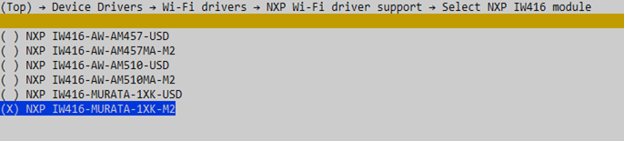

[Index page](../getting-started-iw416-imxrt1060.md)\|[Build and flash examples](../topics/build_and_flash_examples.md)

# Build and flash in Windows
## Wi-Fi shell example

This section shows how to compile the Wi-Fi shell example.

Step 1 - Launch menuconfig and select NXP IW416\_MURATA-1XK-M2. Save the configuration and exit.

```
cd %HOMEPATH%\zephyrproject\zephyr
west build -b mimxrt1060_evk@C samples/net/wifi/shell -d wifi_shell -t menuconfig --pristine
```



Step 2 - Build the application.

```
west build -b mimxrt1060_evk@C samples/net/wifi/shell -d wifi_shell
```

Step 3 - Flash the application.

```
set PATH=%PATH%;C:\nxp\LinkServer_1.5.30 # Change the Linkserver path
west flash --runner linkserver -d wifi_shell
```

**Note:** To run the Wi-Fi Shell application, refer to [Wi-Fi shell example](wi-fi_shell_example_windows.md).

## Bluetooth shell example

This section shows how to compile the Bluetooth shell example.

Step 1 - Build the application.

```
cd %HOMEPATH%\zephyrproject\zephyr
west build -p always -b mimxrt1060_evk@C -d bluetooth_shell --shield nxp_m2_bt_uart tests/bluetooth/shell -- -DCONFIG_BT_NXP_IW416=y
```

Step 2 - Flash the application.

```
set PATH=%PATH%;C:\nxp\LinkServer_1.5.30 # Change the Linkserver path
west flash --runner linkserver -d bluetooth_shell
```

**Note:** To run the Bluetooth Shell application, refer to [Bluetooth shell example](bluetooth_shell_example_windows.md).

## Coexistence shell example

This section shows how to compile the Coexistence shell example.

Step 1 - Build the application.

```
cd %HOMEPATH%\zephyrproject\zephyr
west build -p always -b mimxrt1060_evk --shield nxp_m2_bt_uart tests/bluetooth/shell -d coex_shell -- -DCONFIG_BT_NXP_IW416=y -DEXTRA_CONF_FILE="overlay-wifi-nxp-coex.conf" -DEXTRA_DTC_OVERLAY_FILE="boards/coex_iw416_nw612_mimxrt1060_evkc.overlay"
```

Step 2 - Flash the application.

```
set PATH=%PATH%;C:\nxp\LinkServer_1.5.30 # Change the Linkserver path
west flash --runner linkserver -d coex_shell
```

**Note:** To run the Coexistence shell example, refer to [Coexistence shell example](coexistence_shell_example_windows.md).


**Parent topic:** [Build and flash examples](../topics/build_and_flash_examples.md)

