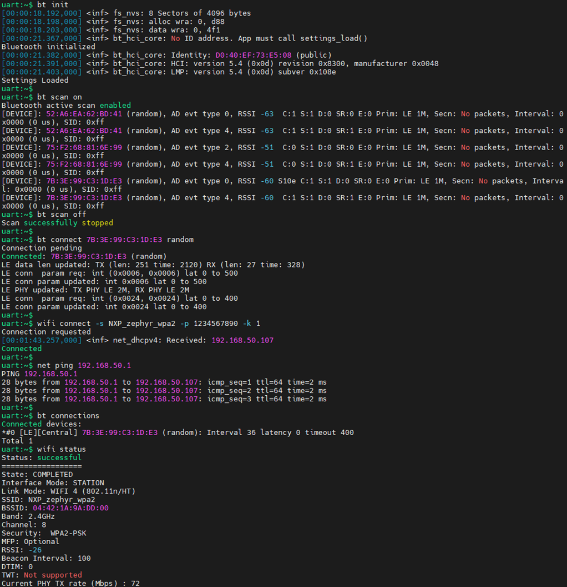

[Index page](../getting-started-iw416-imxrt1060.md)

# Run coexistence shell example

Ensure that the Coexistence shell example is flashed onto the IW416 module and i.MX RT1060 EVKC board. Refer to [Build and flash examples](build_and_flash_examples.md).

This section demonstrates the coexistence feature by simultaneously connecting Wi-Fi on 2.4 GHz and establishing the Bluetooth LE connection.

Steps to establish the Bluetooth LE and Wi-Fi connection:

Step 1 - Initialize the Bluetooth LE. Refer to [Bluetooth LE scan and connect](bluetooth_le_scan_and_connect.md).

```
bt init
```

Step 2 - Scan the Bluetooth LE devices. Refer to [Bluetooth LE scan and connect](bluetooth_le_scan_and_connect.md).

```
bt scan on //To start scanning
bt scan off //To stop scanning
```

Step 3 - Connect with Bluetooth LE device. Refer to [Bluetooth LE scan and connect](bluetooth_le_scan_and_connect.md).

```
bt connect <address> <type>
```

Step 4 - Connect the Wi-Fi radio \(configure the channel in 2.4 GHz\) with an external access point in WPA2 personal mode. Refer to [STA configuration in WPA2 personal mode](sta_configuration_in_wpa2_personal_mode.md).

```
wifi connect -s <ssid> -p <password> -k 1
```

Step 5 - Check the data traffic on the Wi-Fi interface using `ping` command.

```
net ping <IP address>
```

Step 6 - Check the status of the Wi-Fi connection.

```
wifi status
```

Step 7 - Check the status of the Bluetooth LE connection.

```
bt info
```

OR

```
bt connections
```

Sample output:



