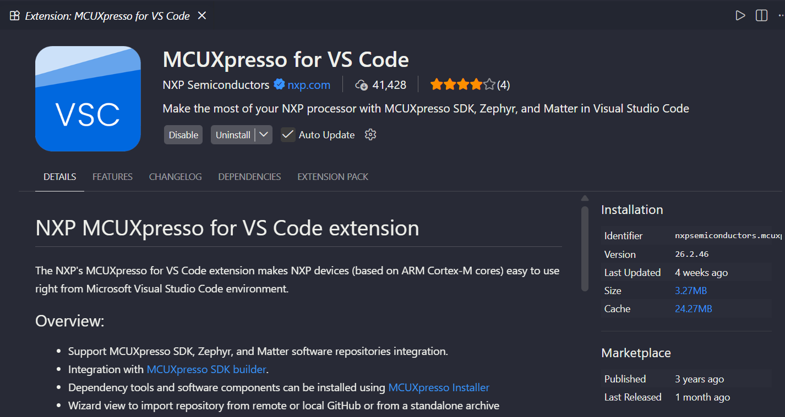
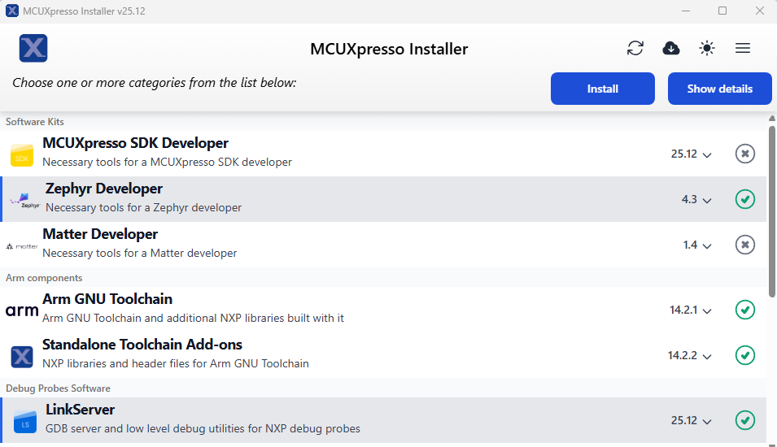
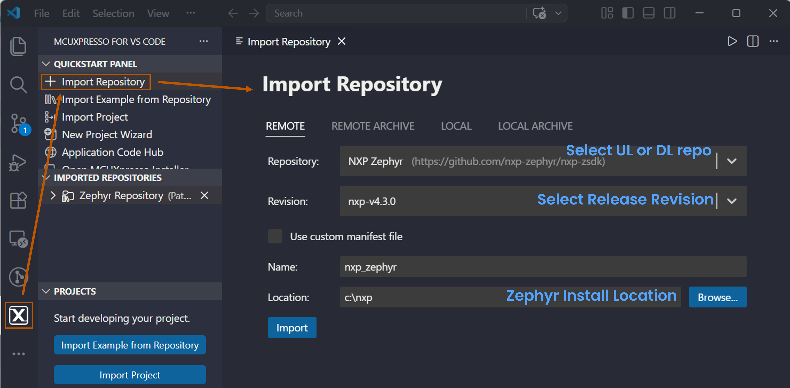

[Index page](../getting-started-iw416-imxrt1060.md) \| [Software setup](software_setup.md)

# Software setup for Windows (VS Code)

## Install dependencies for Windows

Step 1 - Download and install Visual Studio Code.

[https://code.visualstudio.com/download](https://code.visualstudio.com/download)

Step 2 - Install MCUXpresso Extension in VS Code:

Open the **Extensions** tab on the left panel of the VS Code, look for **MCUXpresso for VS Code** at the search bar and install the extension.

Step 3 - Download and run MCUXpresso Installer.

Link: [MCUXpresso Installer](https://www.nxp.com/design/design-center/software/development-software/mcuxpresso-software-and-tools-/mcuxpresso-installer:MCUXPRESSO-INSTALLER)

Install **Zephyr Developer** to support CMake, Python, GCC, and other Zephyr dependencies along with **LinkServer** software pack for NXP LinkServer debug probe.

## Import the Zephyr Repository

Open the MCUXpresso extension on the left panel. To open the **Import Repository** dialog window, click the **+** button in the **QUICKSTART PANEL** tab. Select the Zephyr repository, release revision, and install location on the **REMOTE** tab.

**Note:** The Zephyr repository is downloaded from GitHub automatically in the install location and is present in "IMPORTED REPOSITORIES".

**Parent topic:** [Software setup](../topics/software_setup.md)

