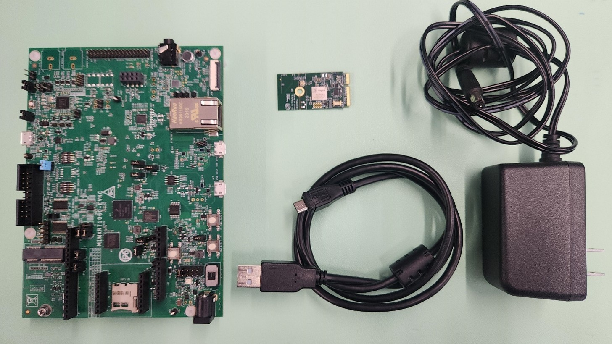
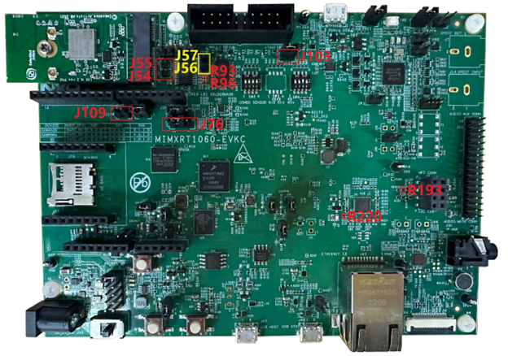
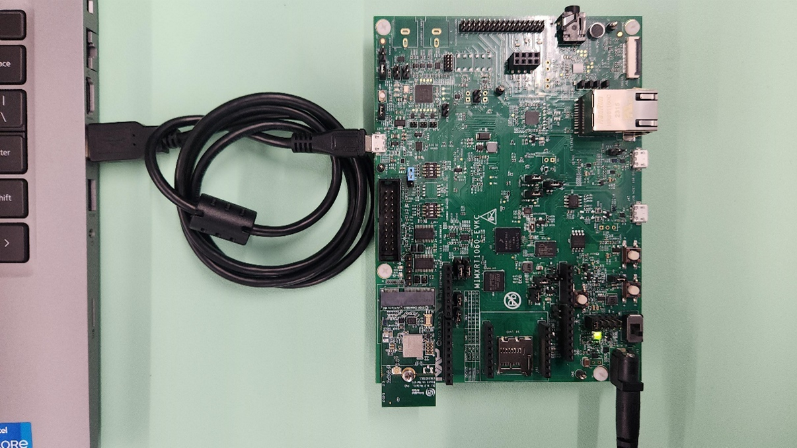

[Index page](../getting-started-iw610-imxrt1060.md)

# Hardware setup

This section details the hardware setup required to bring up Murata 2LL M.2 (IW610) and i.MX RT1060 EVKC running Zephyr OS. It includes the required rework and connections.

## Hardware requirements

- MIMXRT1060-EVKC board
- Murata 2LL M.2 Adapter Module (NXP IW610 based solution)
- micro-USB to USB-A cable
- External 5 V power supply with power jack male connector
- Laptop/PC \(check the software setup for OS detail\)

**Note:**
Murata 2LL M.2 requires an external power supply as the USB power supply of i.MX RT1060 EVKC is not sufficient.

## Hardware rework

To enable UART and PCM interface over M.2 on i.MX RT1060 EVKC, some hardware rework is required.

**HCI UART rework**

1.Mount R93, R96
2.Remove R193
3.Connect J109, connect J76 2-3

**PCM interface rework**

1.Remove J54 and J55, connect J56, and J57
2.Remove R220
3.Connect J103

**Note:** When J103 is connected, flashing cannot be completed. Remove the J103 during flashing and reconnect the jumper when the flashing is completed.

## Hardware connection

The following image illustrates the hardware connection required for the setup. Murata 2LL M.2 module can be connected to i.MX RT1060 EVKC directly through the M.2 slot.

- Connect the external power supply to J45.
- Set J40: 1-2 and turn on SW6.

