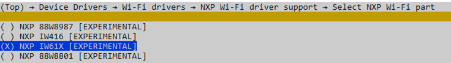
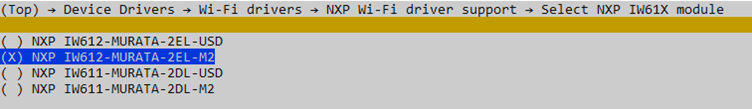

[Index page](../getting-started-iw612-imxrt1060.md)\|[Build and flash examples](build_and_flash_examples.md)

# Build and flash in Ubuntu
## Wi-Fi shell example

This section shows how to compile the Wi-Fi shell example.

Step 1 - Launch menuconfig and select NXP IW612-MURATA-2EL-M2. Save the configuration and exit.

```
cd ~/zephyrproject/zephyr
west build -b mimxrt1060_evk@C samples/net/wifi/shell -d wifi_shell -t
menuconfig --pristine
```




Step 2 - Build the application.

```
west build -b mimxrt1060_evk@C samples/net/wifi/shell -d wifi_shell
```

Step 3 - Flash the application.

```
export PATH=$PATH:/usr/local/LinkServer_24.12.21 # Change the Linkserver path
west flash --runner linkserver -d wifi_shell
```

**Note:** To run the Wi-Fi Shell application, refer to [Wi-Fi shell example](wi-fi_shell_example_ubuntu.md).

## Bluetooth shell example

This section shows how to compile the Bluetooth shell example.

Step 1 - Build the application.

```
cd ~/zephyrproject/zephyr
west build -p always -b mimxrt1060_evk@C -d bluetooth_shell --shield nxp_m2_bt_uart tests/bluetooth/shell -- -DCONFIG_BT_NXP_NW612=y
```

Step 2 - Flash the application.

```
export PATH=$PATH:/usr/local/LinkServer_24.12.21 # Change the Linkserver path
west flash --runner linkserver -d bluetooth_shell
```

**Note:** To run the Bluetooth Shell application, refer to [Bluetooth shell example](bluetooth_shell_example_ubuntu.md).

<!--
## Coexistence shell example

This section shows how to compile the Coexistence shell example.

Step 1 - Build the application.

```
cd ~/zephyrproject/zephyr
west build -p always -b mimxrt1060\_evk --shield nxp\_m2\_bt\_uart tests/bluetooth/shell -d coex\_shell -- -DCONFIG\_BT\_NXP\_IW416=y -DEXTRA\_CONF\_FILE="overlay-wifi-nxp-coex.conf" -DEXTRA\_DTC\_OVERLAY\_FILE="boards/coex\_iw416\_nw612\_mimxrt1060\_evkc.overlay"
```

Step 2 - Flash the application.

```
export PATH=$PATH:/usr/local/LinkServer\_24.12.21 \# Change the Linkserver path

west flash --runner linkserver -d coex\_shell
```

**Note:** To run the Coexistence shell application, refer to [Coexistence shell example](coexistence_shell_example_ubuntu.md).
-->

**Parent topic:** [Build and flash examples](../topics/build_and_flash_examples.md)

