[Index page](../getting-started-iw612-imxrt1060.md) \| [Build and flash examples](build_and_flash_examples.md)

# Build and flash in Windows (VS Code)
## Wi-Fi shell example

This section shows how to import and compile the Wi-Fi shell example in VS Code.

Step 1 - Import an example from the Zephyr repository.

Open the **Import Example from the Repository** dialog window, fill the fields as described, and then click the **Import** button.

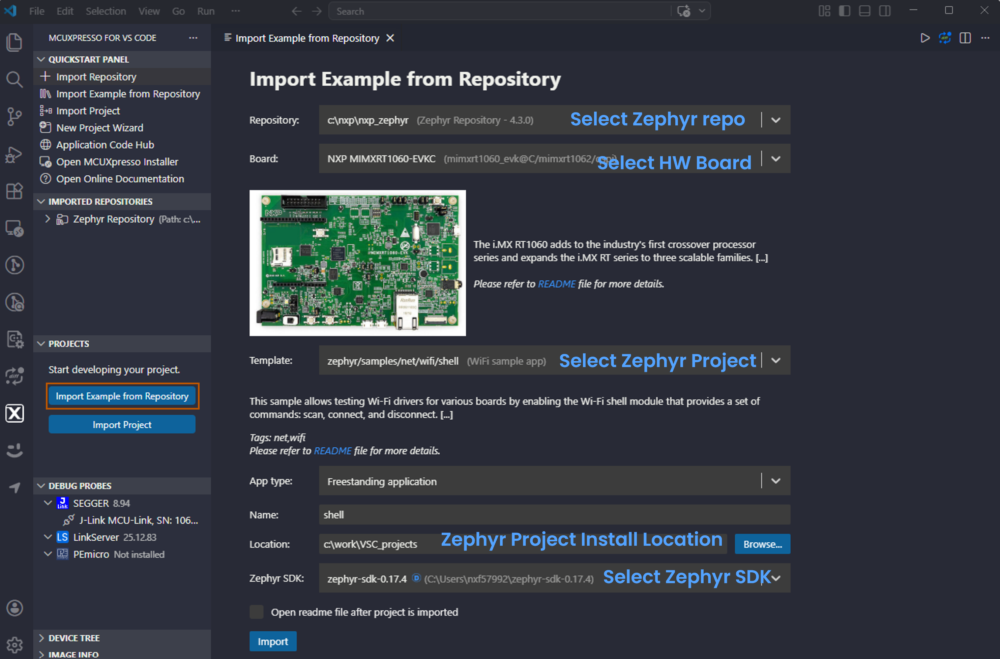

Step 2 - Build configurations of IW612\_MURATA-2EL-M2.

Click the **Edit** button of the **Build Configurations**. Add below settings in the **CMake Extra Args** field of the dialog window.

```
SHIELD='nxp_m2_2el_wifi_bt' EXTRA_CONF_FILE='nxp/overlay_hosted_mcu.conf;nxp/overlay_debug.conf;nxp/overlay_hostap_hosted_mcu.conf'
```

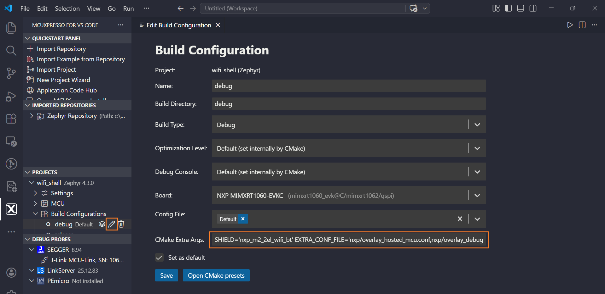

**Note:** The configurations are saved to the *CMakePresets.json* file of the project.

Step 3 - Build the application.

To build the application, click the **Build Project** button of the imported project.

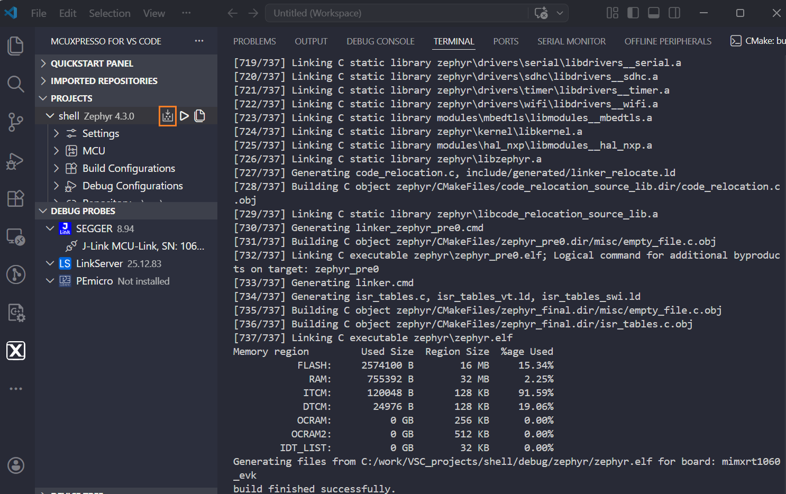

Step 4 - Flash the application.

To flash the Wi-Fi shell application to the MIMXRT1060 board, right-click the imported project and select **Flash the Selected Target**.

**Note:** Change SW4 on MIMXRT1060-EVKC board to 0000 mode for image downloading, and change back to 0100 mode after the image is downloaded.

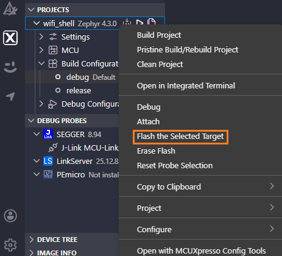

**Note:** To run the Wi-Fi shell application, refer to [Wi-Fi shell example](run_wi-fi_shell_example.md).

## Bluetooth shell example

This section shows how to import and compile the Bluetooth shell example in VS Code.

Step 1 - Import an example from the Zephyr repository.


Step 2 - Build configurations of IW612\_MURATA-2EL-M2.

Add below settings in the **CMake Extra Args** field.

```
SHIELD='nxp_m2_2el_wifi_bt'
```

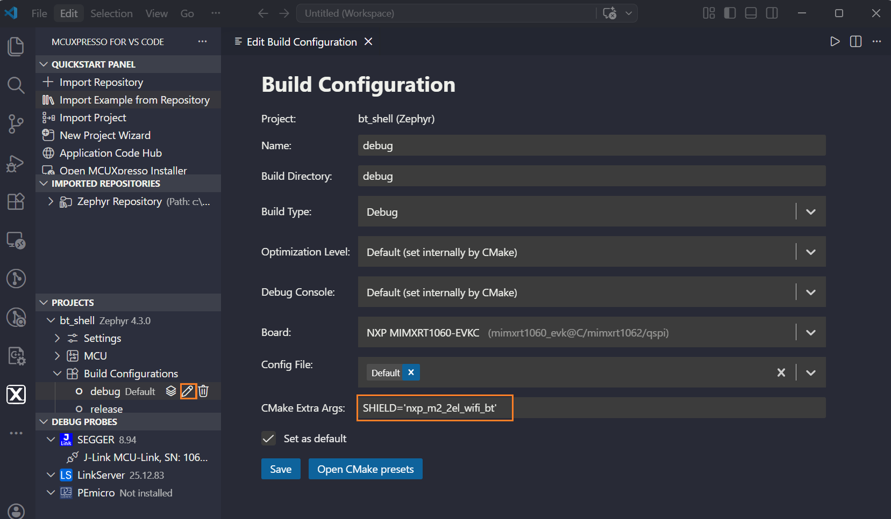

Step 3 - Build the application.

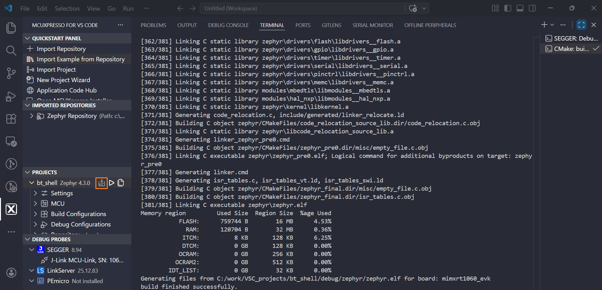

Step 4 - Flash the application.

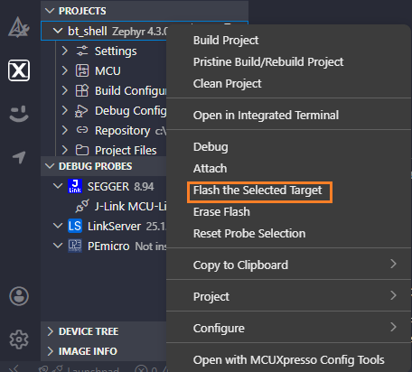

**Note:** To run the Bluetooth shell application, refer to [Bluetooth shell example](run_bluetooth_shell_example.md).

## Coexistence shell example

This section shows how to import and compile the Coexistence shell example in VS Code.

Step 1 - Import an example from the Zephyr repository.

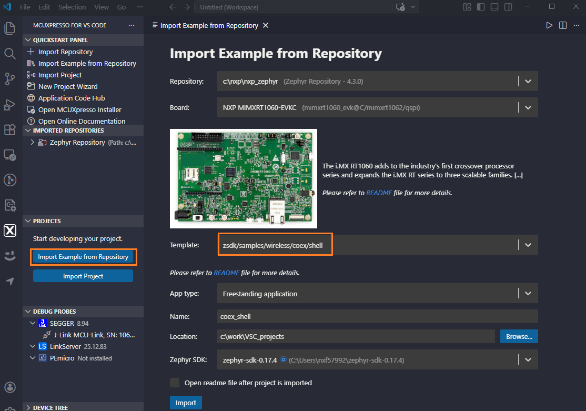

Step 2 - Build configurations of IW612\_MURATA-2EL-M2.

Add below settings in the **CMake Extra Args** field.

```
SHIELD='nxp_m2_2el_wifi_bt' EXTRA_CONF_FILE='overlay-wifi-nxp-hosted-mcu.conf'
```

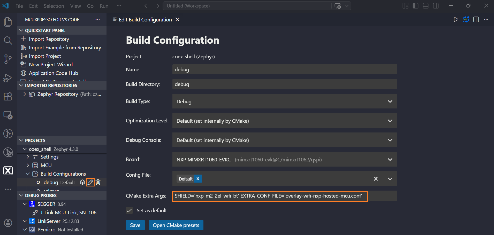

Step 3 - Build the application.

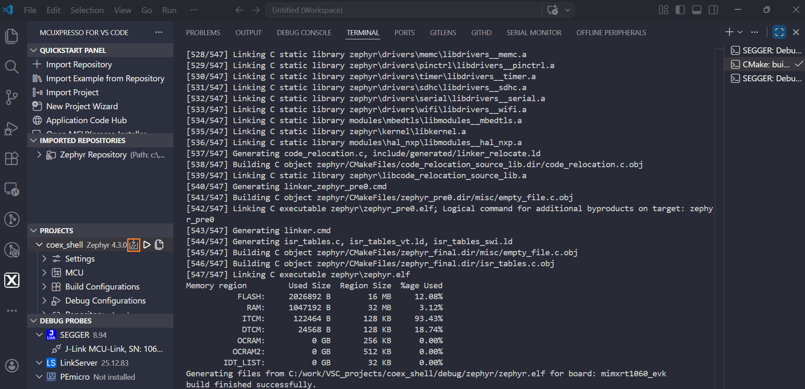

Step 4 - Flash the application.

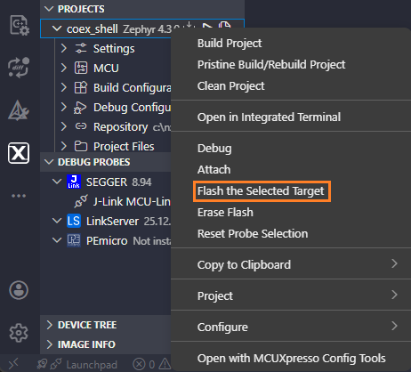

**Note:** To run the Coexistence shell application, refer to [Coexistence shell example](run_coexistence_shell_example.md).


**Parent topic:** [Build and flash examples](../topics/build_and_flash_examples.md)
