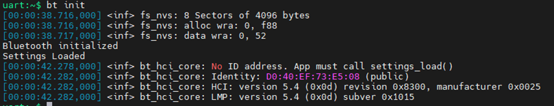
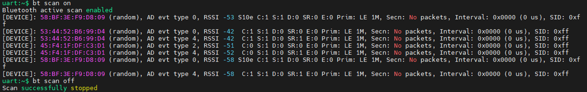

[Index page](../getting-started-iw612-imxrt1060.md)

# Run Bluetooth shell example

Ensure the Bluetooth shell example is flashed onto the IW612 module and i.MX RT1060 EVKC board. Refer to [Build and flash examples](build_and_flash_examples.md).

This section describes how to initialize Bluetooth and scan to list the nearby devices.

## Bluetooth LE scan and connect

Command to initialize Bluetooth.

**Note:** Issue this command before any other Bluetooth LE command.

```
bt init
```

Sample output:



Command to start scanning:

```
bt scan on
```

Command to stop scanning:

```
bt scan off
```

Sample output:



Command to connect

```
bt connect <address> <type>
```

|Parameter|Description|
|---------|-----------|
|`address`|The MAC address of the remote device|
|`type`|Address type of the remote device<br> public = public device address<br> random = random device address|

Sample output:


