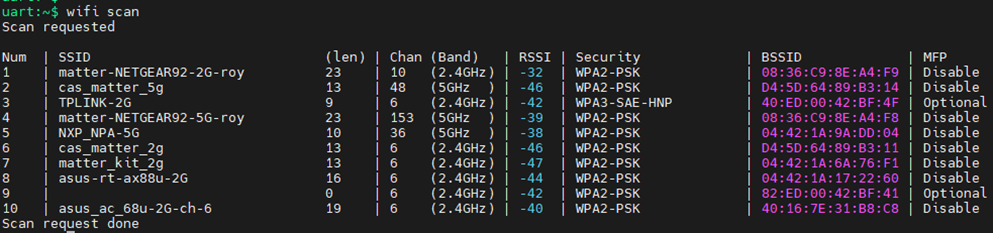
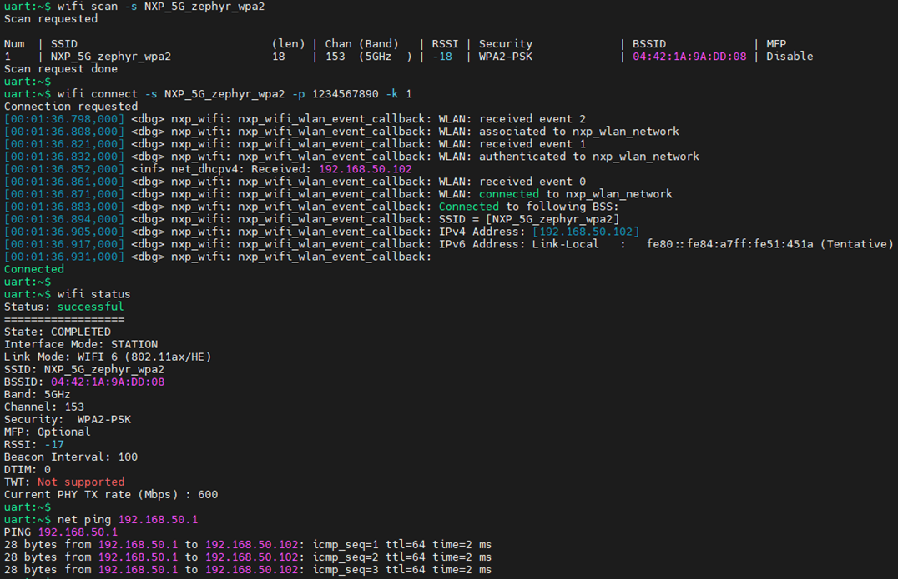
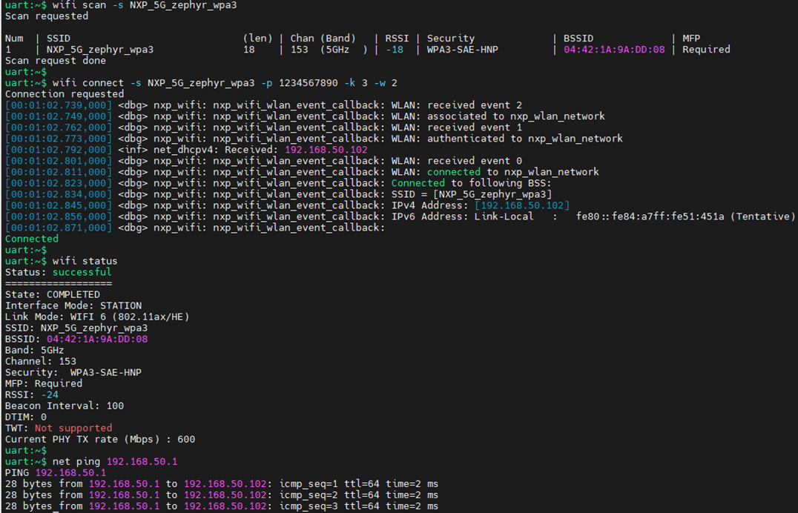
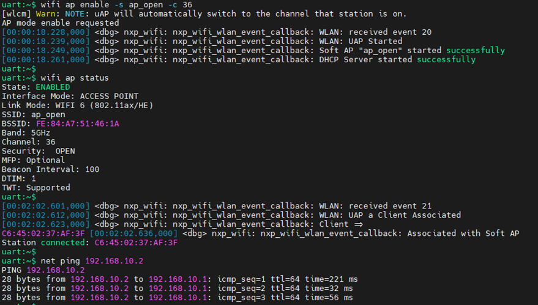
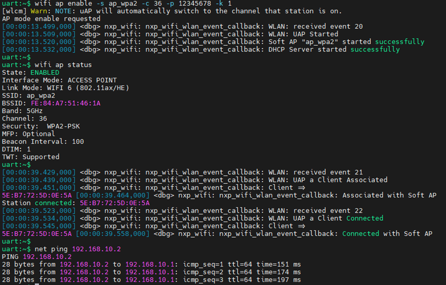
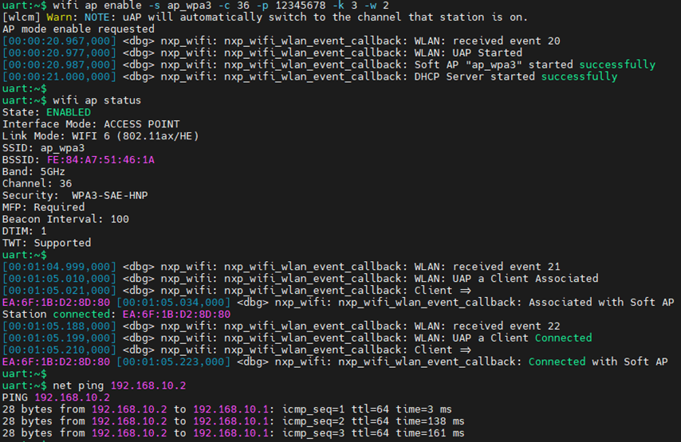

[Index page](../getting-started-iw612-imxrt1060.md)
# Run Wi-Fi shell example

Ensure the Wi-Fi shell example is flashed onto the IW612 module and i.MX RT1060 EVKC board. Refer to [Build and flash examples](build_and_flash_examples.md).

This section describes how to configure the access point \(AP mode\) and the connection with the access point \(STA mode\).

## Scan the network

The scan command is used to scan the visible access points.

```
wifi scan
```

Sample output:



## STA configuration in open mode

Command to connect with an access point in Open security mode:

```
wifi connect -s <ssid>
```

|Parameter|Description|
|---------|-----------|
|-s|SSID of access point|

Sample output:


## STA configuration in WPA2 personal mode

Command to connect with an access point in WPA2 personal security mode:

```
wifi connect -s <ssid> -p <password> -k 1
```

|Parameter|Description|
|---------|-----------|
|-s|SSID of access point|
|-k|Key Management type 1 = WPA2-PSK|

Sample output:




## STA configuration in WPA3 personal mode

Command to connect with an access point in WPA3 personal security mode.

```
wifi connect -s <ssid> -p <password> -k 3 -w 2
```

|Parameter|Description|
|---------|-----------|
|-s|SSID of access point|
|-k|Key Management type 3 = SAE-HNP|
|-w|Management Frame Protection 2 = Required|

Sample output:



## AP configuration in open mode

Command to bring up the access point in open security mode:

```
wifi ap enable -s <ssid> -c <channel number>
```

|Parameter|Description|
|---------|-----------|
|-s|SSID of access point|
|-c|channel number|

Sample output:



## AP configuration in WPA2 personal mode

Command to bring up the access point in WPA2 personal security mode:

```
wifi ap enable -s <ssid> -c <channel number> -p <passphrase> -k 1
```

Command parameters

|Parameter|Description|
|---------|-----------|
|-s|SSID|
|-c|channel number|
|-p|passphrase|
|-k|Security type 1 = WPA2-PSK|

Sample output:



## AP configuration in WPA3 personal mode

Command to bring up the access point in WPA3 personal security mode:

```
wifi ap enable -s <ssid> -c <channel number> -p <passphrase> -k 3 -w 2
```

|Parameter|Description|
|---------|-----------|
|-s|SSID|
|-c|channel number|
|-p|passphrase|
|-k|Security type 3 = SAE-HNP|
|-w|Management Frame Protection 2 = Required|

Sample output:


