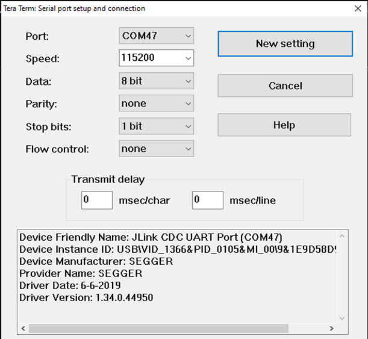

[Index page](../getting-started-iw612-imxrt1060.md) \| [Software setup](software_setup.md)

# Software setup for Windows

## Install dependencies for Windows

You must use the command prompt \(cmd.exe\) as administrator to issue the commands below. For Windows 10 and later, install the Windows Terminal application from the Microsoft store \(recommendation\).

**Note:** The commands differ on PowerShell than cmd.exe.

Step 1 - Install Chocolatey package manager.

[https://chocolatey.org/install](https://chocolatey.org/install)

Step 2 - Disable the global confirmation so you avoid having to confirm the installation of individual programs:

``` {#codeblock_rr3_knk_cfc}
choco feature enable -n allowGlobalConfirmation
```

Step 3 - Use choco to install the required dependencies:

``` {#codeblock_mzz_knk_cfc}
choco install cmake --installargs 'ADD_CMAKE_TO_PATH=System'
choco install ninja gperf python311 git dtc-msys2 wget 7zip strawberryperl
```
## Install Linkserver utility

LinkServer utility provides firmware updates to devices with MCU-Link architecture \(i.MX RT1060 EVKC\). The utility is also used to debug.

Step 1 - Download the LinkServer utility for Windows

Link: [LinkServer for Microcontrollers \| NXP Semiconductors](https://www.nxp.com/design/design-center/software/development-software/mcuxpresso-software-and-tools-/linkserver-for-microcontrollers:LINKERSERVER)

Step 2 - Install the downloaded executable.

Linkserver is installed at *C:\\NXP\\LinkServer\_&lt;version number&gt;*. The path is used later to flash the application to i.MX RT1060 EVKC.

## Install the serial console utility

The serial console tool is used to read out the demo application logs or to access the command prompt of the application on the computer connected to i.MX RT EVK board.

Download and install the terminal emulator software such as [Tera Term](https://teratermproject.github.io/index-en.html) or [Putty](https://www.putty.org/).

TeraTerm and Putty application in Windows use following setting for serial console access.



**Note:** Configure the COM port accordingly in minicom or Tera Term.

## Get Zephyr and install Python dependencies for Windows

This section includes the commands to clone Zephyr downstream and Zephyr [modules](https://docs.zephyrproject.org/latest/develop/modules.html) into a new [west](https://docs.zephyrproject.org/latest/develop/west/index.html) workspace. In this section, *zephyrproject* is the name of the workspace. Any name and location can be used.

Step 1 - Open a `cmd.exe` terminal window as regular user

Step 2 - Create a new virtual environment.

``` {#codeblock_dkr_14k_cfc}
cd %HOMEPATH%
python -m venv zephyrproject\.venv
```

Step 3 - Activate the virtual environment.

``` {#codeblock_hgl_b4k_cfc}
zephyrproject\.venv\Scripts\activate.bat
```

Step 4 - Install west.

``` {#codeblock_b3y_b4k_cfc}
pip install west
```

Step 5 - Get the Zephyr source code.

``` {#codeblock_qhz_c4k_cfc}
west init zephyrproject -m https://github.com/nxp-zephyr/nxp-zsdk.git --mr nxp-v4.1.0
cd zephyrproject
west update
```

Step 6 - Export a Zephyr CMake package.

``` {#codeblock_xtn_d4k_cfc}
west zephyr-export
```

Step 7 - Install Python dependencies.

``` {#codeblock_pnb_24k_cfc}
pip install -r zephyr\scripts\requirements.txt
```
## Install the Zephyr SDK

The Zephyr software development kit \(SDK\) contains toolchains for each Zephyr supported architecture, including a compiler, assembler, linker and other programs required to build Zephyr applications.

Step 1 - Install the Zephyr SDK.

``` {#codeblock_c1h_q4k_cfc}
cd %HOMEPATH%\zephyrproject\zephyr
west sdk install
```

**Parent topic:** [Software setup](../topics/software_setup.md)

