[Index page](../getting-started-RW612.md) \| [Build and flash examples](build_and_flash_examples.md)

# Build and flash in Windows (VS Code)
## Wi-Fi shell example

This section shows how to compile the Wi-Fi shell example with VS Code.

Step 1 - Import NXP Zephyr repository from VS Code:
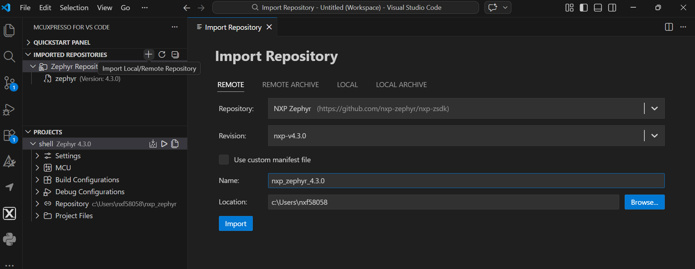

Step 2 - Import a Wi-Fi shell example from the NXP Zephyr repository:
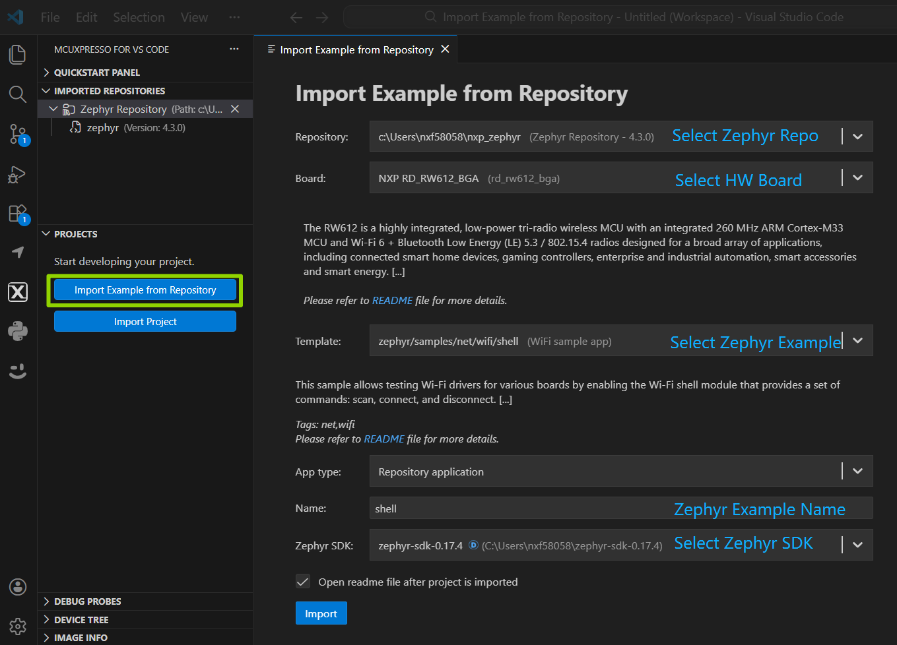

Step 3 - Select the config file for the Wi-Fi shell example:
Go to **Build Configurations -> debug** and click **Edit**. Select the targeted config file.
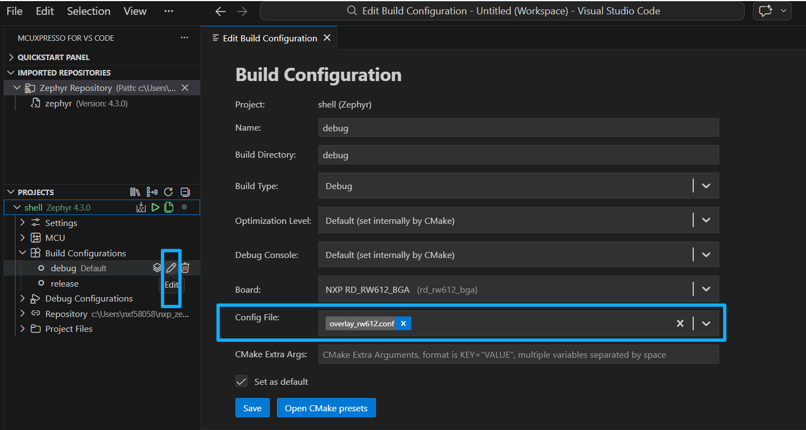

Step 4 - Build a Wi-Fi shell example:
Right-click the example name and then click **Build Project** on the pop menu.
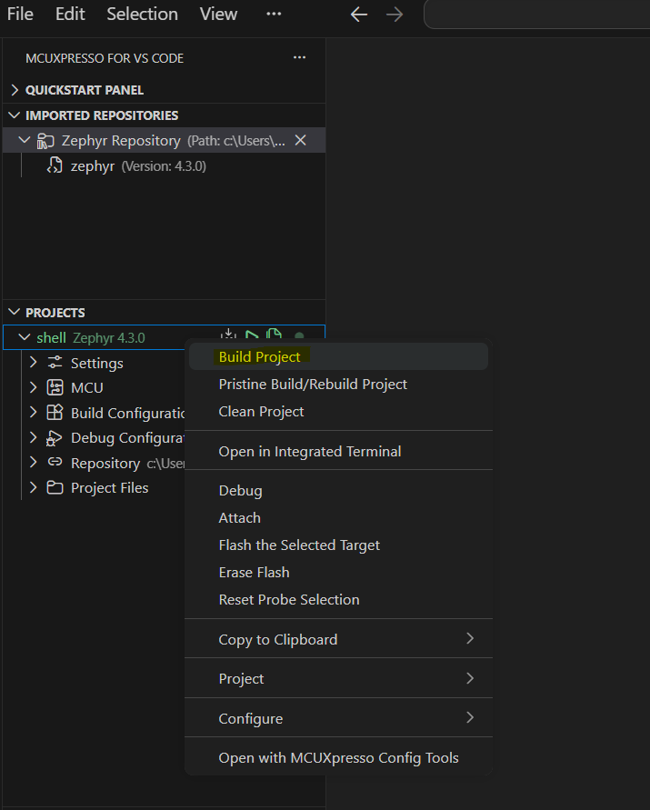

Step 5 - Flash the example:
Click the **Debug** button, which flashes the example into the RW612 board.
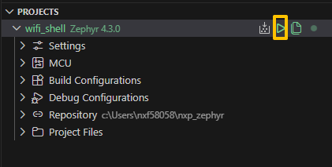

**Note:** To run the Wi-Fi shell application, refer to [Wi-Fi shell example](run_wi-fi_shell_example.md).

## Bluetooth shell example

 To build and flash the Bluetooth shell example, follow the same procedure as for the Wi‑Fi shell example.

Step 1 - Import NXP Zephyr repository from VS Code:

Step 2 - Import a Bluetooth shell example from the NXP Zephyr repository:
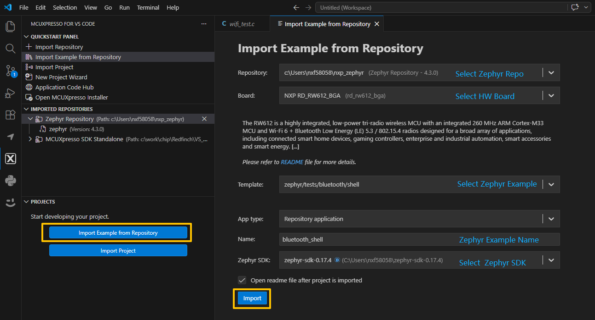

Step 3 - Build a Bluetooth shell example:
Right-click the example name and then click **Build Project** on the pop menu.

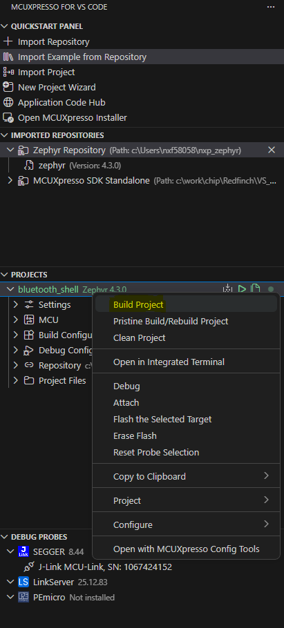

Step 4 - Flash the example:
Click the **Debug** button, which flashes the example into the RW612 board.
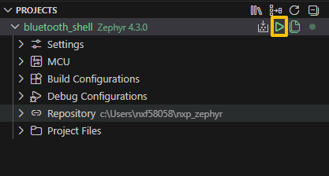

## Coexistence shell example

To build and flash the Coexistence shell example, follow the same procedure as for the Wi-Fi/Bluetooth shell example.

Step 1 - Import NXP Zephyr repository from VS Code:

Step 2 - Import Coexistence shell example from the NXP Zephyr repository:
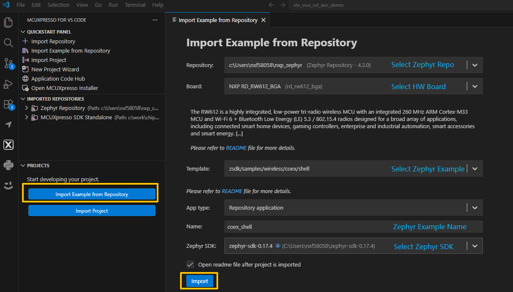

Step 3 - Build a Coexistence shell example:
Right-click the example name and then click **Build Project** on the pop menu.

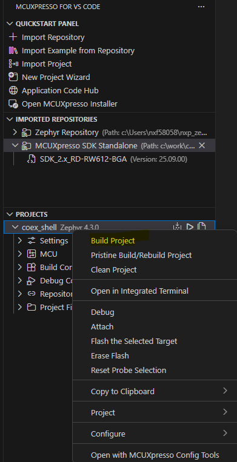

Step 4 - Flash the example:
Click the **Debug** button, which flashes the example into the RW612 board.

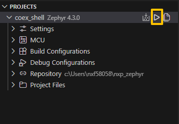

**Note:** To run the Coexistence shell application, refer to [Coexistence shell example](run_coexistence_shell_example.md).

**Parent topic:** [Build and flash examples](../topics/build_and_flash_examples.md)
