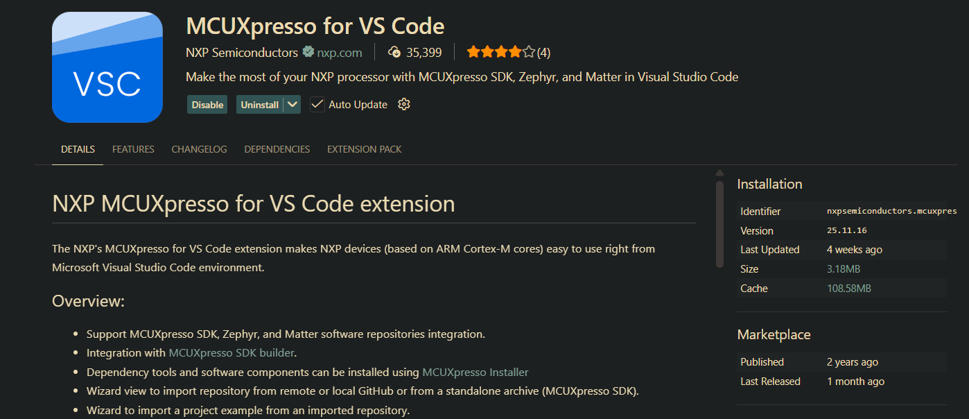
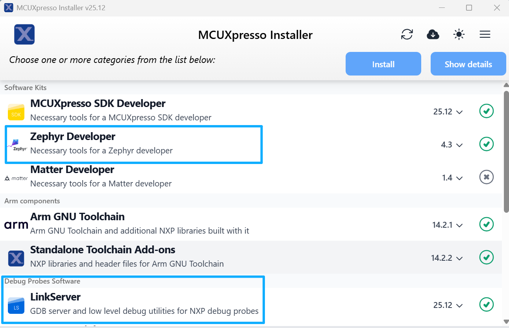

[Index page](../getting-started-RW612.md) \| [Software setup](software_setup.md)

# Software setup for Windows (VS Code)

## Install dependencies for Windows

Step 1 - Download and install Visual Studio Code.

[https://code.visualstudio.com/download](https://code.visualstudio.com/download)

Step 2 - Install MCUXpresso Extension in VS Code:

Step 3 - Download and install MCUXpresso Installer:
[MCUXpresso Installer](https://www.nxp.com/design/design-center/software/development-software/mcuxpresso-software-and-tools-/mcuxpresso-installer:MCUXPRESSO-INSTALLER)

Step 4 - Install Zephyr Developer to support CMake, Python, GCC, and other Zephyr dependencies along with LinkServer software pack for NXP LinkServer debug probe.

**Parent topic:** [Software setup](../topics/software_setup.md)

